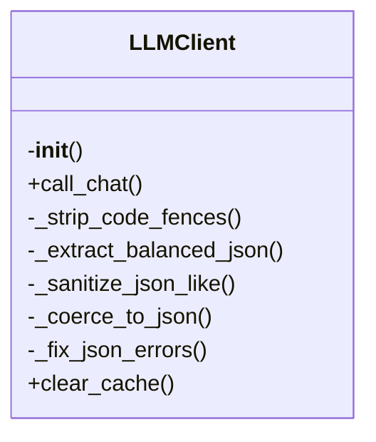

# llm.py

*Auto-generated from `.github/scripts/llm.py`*

# llm.py – Centralized LLM Client

> **TL;DR** – A lightweight, retry‑enabled wrapper around the Groq (or any OpenAI‑compatible) API that automatically caches responses, coerces text into valid JSON, and exposes a convenient singleton helper.

---

## 1. Overview

`llm.py` provides a **single, reusable LLM client** that handles:

- **Retry logic** – exponential back‑off on 429 / 5xx responses and timeouts (3 attempts by default).  
- **Caching** – stores successful responses in a local `.llm-cache` directory keyed by a hash of the request; identical calls hit the cache instantly.  
- **JSON coercion** – when `response_format='json'`, the client extracts and sanitises JSON from noisy LLM output (strips code fences, balances brackets, normalises quotes, removes trailing commas, escapes newlines, etc.).  
- **Environment‑aware configuration** – reads API credentials from `GROQ_API_KEY`/`GROQ_API_URL` or the generic `LLM_*` variables.  
- **Singleton helper** – `get_client()` returns a global `LLMClient` instance, so you can call `get_client().call_chat(...)` from anywhere in your repo.  
- **Cache cleanup** – `LLMClient.clear_cache()` removes cached files, optionally filtered by a pattern.

The module is intentionally lightweight (no external dependencies beyond `requests`) and is designed to be dropped into any Python script or GitHub Action that needs to talk to an OpenAI‑compatible API (Groq, OpenAI, Anthropic, etc.).

---

## ⚠️ Breaking Changes

The following previously exported functions have been **removed** in this version:

- `...` (the exact signatures were corrupted in the source diff; all internal helper functions such as `_strip_code_fences`, `_extract_balanced_json`, `_sanitize_json_like`, `_coerce_to_json`, `_fix_json_errors`, etc., are now **private** and no longer part of the public API).

If you were relying on any of those helpers, you should switch to the public `call_chat` method and let the client handle JSON coercion internally.

---

## 🏗️ Structure



---

## 2. Exports

| Export | Type | Description |
|--------|------|-------------|
| `GROQ_API_KEY` | `str` | API key read from the environment (`GROQ_API_KEY` or fallback `LLM_API_KEY`). |
| `GROQ_API_URL` | `str` | Endpoint URL (`https://api.groq.com/openai/v1/chat/completions` or fallback `LLM_API_URL`). |
| `CACHE_DIR` | `Path` | Default cache directory (`.llm-cache`). |
| `LLMClient` | class | Main client with `call_chat`, `_coerce_to_json`, `clear_cache`, etc. |
| `get_client` | function | Returns a lazily‑initialised singleton `LLMClient` instance. |

> **Note**: All helper methods prefixed with an underscore are **private** and not part of the public API.

---

## 3. Usage Examples

> **Tip** – All examples assume you have `GROQ_API_KEY` (or the appropriate `LLM_*` variable) set in your environment.

### 3.1. Basic chat call

```python
from .llm import get_client

client = get_client()

response = client.call_chat(
    model="gpt-4o-mini",
    messages=[
        {"role": "system", "content": "You are a helpful assistant."},
        {"role": "user",   "content": "What is the capital of France?"}
    ],
    temperature=0.2,
    max_tokens=150,
    response_format="text"   # or "json"
)

print(response)
```

### 3.2. Request JSON and auto‑coerce

```python
json_resp = client.call_chat(
    model="gpt-4o-mini",
    messages=[{"role": "user", "content": "Return a JSON list of 3 colors."}],
    response_format="json"
)

# `json_resp` is a *string* containing valid JSON
import json
data = json.loads(json_resp)
print(data)  # e.g. ['red', 'green', 'blue']
```

### 3.3. Using the singleton helper anywhere in your code

```python
# utils.py
from .llm import get_client

def ask(question: str) -> str:
    client = get_client()
    return client.call_chat(
        model="gpt-4o-mini",
        messages=[{"role": "user", "content": question}],
        response_format="text"
    )
```

### 3.4. Clearing the cache (optional)

```python
from .llm import get_client

client = get_client()
client.clear_cache()               # removes all cached files
# or clear only a subset
client.clear_cache(pattern="gpt-4o-mini*")
```

---

*Last updated: 2025-12-25*