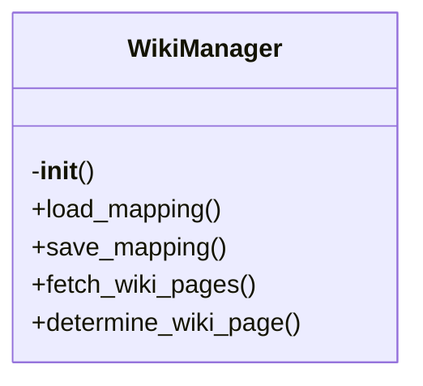

# wiki-manager.py

*Auto-generated from `.github/scripts/wiki-manager.py`*

## 🏗️ Structure



# 📚 `wiki-manager.py` – Smart Wiki Manager

> A Python script that automatically routes documentation files to the correct GitHub Wiki pages.  
> It uses a persistent mapping, fetches existing wiki pages, and leverages an LLM (Groq) to decide where each file belongs.  
> The script is intended to be run as part of a CI workflow whenever source files change.

---

## 1. Overview

- **Persistent mapping** – Keeps a JSON file (`.github/wiki-mapping.json`) that remembers which source file maps to which wiki page.
- **GitHub Wiki integration** – Pulls the list of existing wiki pages via the GitHub API.
- **LLM‑powered routing** – Uses Groq’s GPT‑OSS model to decide the best page name based on file content, existing pages, and past mappings.
- **Intelligent merging** – When a page already exists, the script merges new content with the old one using the LLM, preserving structure and timestamps.
- **Consistency checks** – After processing, the script verifies that the mapping and metadata are in sync.
- **Summary generation** – Produces a `wiki_summary.md` that lists all pages, their files, and the latest updates.

> **Typical workflow**  
> 1. A CI job writes the list of changed source files to `changed_files.txt`.  
> 2. The script maps those files to their Markdown docs in `docs/`.  
> 3. Each doc is routed to the appropriate wiki page, updated, and the mapping is saved.

---

## 2. Exports

| Export | Type | Description |
|--------|------|-------------|
| `WikiManager` | Class | Core manager that handles mapping, page determination, merging, and consistency. |
| `process_documentation_to_wiki(doc_files: List[str])` | Function | Main entry point that processes a list of Markdown docs. |
| `__main__` block | Script | Parses `changed_files.txt`, finds docs, and calls `process_documentation_to_wiki`. |

> **Note**: The script expects the following environment variables to be set:
> - `GROQ_API_KEY` – Groq API key for LLM calls.  
> - `GITHUB_TOKEN` – Personal access token with `repo` scope for GitHub API.  
> - `GITHUB_REPOSITORY` – `owner/repo` string (e.g., `octocat/Hello-World`).

---

## 3. Usage Examples

### 3.1 Using the CLI (CI Workflow)

```bash
# In your workflow, after detecting changed files:
python .github/scripts/wiki-manager.py
```

The script will:
1. Read `changed_files.txt`.  
2. Find corresponding Markdown docs in `docs/`.  
3. Update the wiki and produce `wiki_summary.md`.

### 3.2 Using the API in Python

```python
from pathlib import Path
from typing import List
from .wiki_manager import WikiManager, process_documentation_to_wiki

# 1. Create a manager instance
manager = WikiManager()

# 2. Process a single documentation file
doc_path = Path('docs/auth.md')
updates = process_documentation_to_wiki([str(doc_path)])

# 3. Inspect the mapping
print(manager.mapping['file_to_page'])
```

### 3.3 Inspecting the Mapping File

```bash
cat .github/wiki-mapping.json
```

The JSON looks like:

```json
{
  "version": "1.0",
  "last_updated": "2025-12-15T12:34:56.789Z",
  "file_to_page": {
    "src/auth.ts": "Authentication-API"
  },
  "page_metadata": {
    "Authentication-API": {
      "created": "2025-12-01T08:00:00Z",
      "last_updated": "2025-12-15T12:34:56Z",
      "files": ["src/auth.ts"]
    }
  }
}
```

---

## 4. Parameters & Return Values

### 4.1 `WikiManager`

| Method | Parameters | Return Value | Description |
|--------|------------|--------------|-------------|
| `__init__()` | None | `WikiManager` instance | Loads mapping and existing wiki pages. |
| `load_mapping() -> Dict` | None | Mapping dictionary | Reads `.github/wiki-mapping.json` or creates a fresh one. |
| `save_mapping() -> None` | None | None | Writes the current mapping to disk. |
| `fetch_wiki_pages() -> List[str]` | None | List of page titles | Calls GitHub API to list wiki pages. |
| `determine_wiki_page(file_path: str, file_content: str) -> str` | `file_path`: source file path; `file_content`: preview of file | Page name (string) | Uses LLM or fallback logic to decide the best page. |
| `update_wiki_page(page_name: str, content: str) -> bool` | `page_name`: target wiki page; `content`: Markdown to add | `True` if file written, `False` on error | Writes/merges content into `wiki_updates/<page_name>.md`. |
| `record_mapping(file_path: str, page_name: str) -> None` | `file_path`: source file; `page_name`: wiki page | None | Updates internal mapping and metadata. |
| `verify_consistency() -> bool` | None | `True` if mapping is consistent, otherwise `False` | Checks for duplicate mappings and metadata mismatches. |
| `generate_summary() -> str` | None | Markdown string | Produces a summary of all wiki pages and their files. |
| `_fallback_page_name(file_path: str) -> str` | `file_path` | Page name | Simple heuristic when LLM fails. |
| `_merge_wiki_content(existing: str, new: str, page_name: str) -> str` | Existing content, new content, page name | Merged Markdown | Uses LLM to merge intelligently. |
| `_simple_merge(existing: str, new: str) -> str` | Existing content, new content | Merged Markdown | Fallback merge (append). |

### 4.2 `process_documentation_to_wiki(doc_files: List[str]) -> List[Dict]`

| Parameter | Type | Description |
|-----------|------|-------------|
| `doc_files` | `List[str]` | Paths to Markdown documentation files (e.g., `docs/auth.md`). |

| Return Value | Type | Description |
|--------------|------|-------------|
| `List[Dict]` | List of dicts | Each dict contains `file` (source file) and `page` (wiki page name) for every successful update. |

---

## 5. Key Implementation Details

- **LLM Prompt** – The script sends a prompt that includes the file name, a preview of its content, existing wiki pages, and a few previous mappings.  
- **Response Cleaning** – The LLM output is trimmed of quotes, code fences, and newlines to extract a clean page name.  
- **Merge Logic** – When merging, the script updates the `Last updated` timestamp and replaces any occurrence of `"Amp Team"` with `"Kynlo Akari"`.  
- **Error Handling** – All network calls are wrapped in `try/except`; failures fall back to heuristics or simple append logic.  
- **Directory Structure** – Updated wiki files are written to `wiki_updates/` so that a subsequent CI step can commit them to the GitHub Wiki repository.

---

## 6. Extending the Script

| Feature | How to Add |
|---------|------------|
| **Custom LLM model** | Change `MODEL` constant or pass a new value to `WikiManager.__init__`. |
| **Different mapping file** | Update `MAPPING_FILE` path. |
| **Add new fallback rules** | Extend `_fallback_page_name`. |
| **Custom merge strategy** | Replace `_merge_wiki_content` logic or add new methods. |

---

## 7. Troubleshooting

| Symptom | Likely Cause | Fix |
|---------|--------------|-----|
| No wiki pages fetched | `GITHUB_TOKEN` or `GITHUB_REPOSITORY` missing | Export the env vars before running. |
| LLM returns empty string | Groq API key invalid or quota exhausted | Verify `GROQ_API_KEY` and check Groq dashboard. |
| Mapping file not updated | Script exits early due to missing docs | Ensure `changed_files.txt` contains correct paths and that docs exist in `docs/`. |
| Merge fails with syntax errors | LLM output wrapped in code fences | The script already strips fences, but if custom prompts are used, adjust the cleaning logic. |

---

## 8. License & Credits

- The script uses the **Groq** API (`https://api.groq.com/openai/v1/chat/completions`).  
- Requires a **GitHub Personal Access Token** with `repo` scope.  
- The code is
