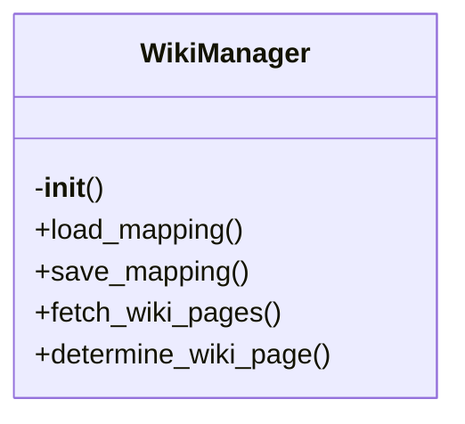

# wiki-manager.py

*Auto-generated from `.github/scripts/wiki-manager.py`*

## 🏗️ Structure



# Wiki Manager Documentation

> **Author:** Kynlo Akari  
> **Version:** 1.0  
> **Last updated:** 2025‑12‑13 10:00:00  

---

## Overview

`wiki-manager.py` is a **Smart Wiki Manager** that automatically routes documentation files to the appropriate GitHub Wiki pages.  
Key features:

| Feature | Description |
|---------|-------------|
| **Persistent mapping** | Keeps a JSON mapping (`.github/wiki-mapping.json`) of source files → wiki pages. |
| **Intelligent routing** | Uses a Groq LLM to decide the best wiki page for a file based on existing pages and prior mappings. |
| **Wiki updates** | Generates or updates markdown files in a `wiki_updates/` directory, ready for a CI workflow to commit. |
| **Consistency checks** | Verifies that mapping and metadata are in sync. |
| **Summary generation** | Produces a `wiki_summary.md` with an overview of pages, files, and update timestamps. |

The script is designed to be run from a CI job that receives a list of changed source files (`changed_files.txt`) and automatically updates the corresponding documentation pages.

---

## Exports

| Export | Type | Description |
|--------|------|-------------|
| `WikiManager` | Class | Core manager handling mapping, LLM calls, and wiki page updates. |
| `process_documentation_to_wiki(doc_files: List[str])` | Function | High‑level entry point that processes a list of markdown docs and updates the wiki. |
| `__main__` block | Script | Parses `changed_files.txt`, maps source files to docs, and invokes `process_documentation_to_wiki`. |

---

## Usage Examples

### 1. Using the `WikiManager` class directly

```python
from wiki_manager import WikiManager

manager = WikiManager()

# Load existing mapping
mapping = manager.load_mapping()

# Determine page for a new file
page = manager.determine_wiki_page('src/auth/login.ts', '...file content...')

# Update the wiki page
manager.update_wiki_page(page, '# Login API\n\nDetails...')

# Record the mapping
manager.record_mapping('src/auth/login.ts', page)

# Persist changes
manager.save_mapping()

# Verify consistency
assert manager.verify_consistency()

# Generate a summary
print(manager.generate_summary())
```

### 2. Running the script from the command line

```bash
# Ensure environment variables are set
export GROQ_API_KEY=your_groq_key
export GITHUB_TOKEN=your_github_token
export GITHUB_REPOSITORY=owner/repo

# Create a list of changed source files
echo "src/auth/login.ts" > changed_files.txt

# Run the manager
python .github/scripts/wiki-manager.py
```

The script will:

1. Read `changed_files.txt`.
2. Find the corresponding markdown docs in `docs/`.
3. Update or create wiki pages under `wiki_updates/`.
4. Save the mapping to `.github/wiki-mapping.json`.
5. Generate `wiki_summary.md`.

---

## Parameters & Return Values

### `WikiManager.__init__(self)`

| Parameter | Type | Description |
|-----------|------|-------------|
| *None* | | Initializes the manager, loading mapping and fetching existing wiki pages. |

| Return | Type | Description |
|--------|------|-------------|
| *None* | | Instance is ready for use. |

---

### `WikiManager.load_mapping(self) -> Dict`

| Parameter | Type | Description |
|-----------|------|-------------|
| *None* | | Reads the persistent mapping file. |

| Return | Type | Description |
|--------|------|-------------|
| `Dict` | Mapping structure (see `save_mapping` for format). |

---

### `WikiManager.save_mapping(self) -> None`

| Parameter | Type | Description |
|-----------|------|-------------|
| *None* | | Writes the current mapping to `.github/wiki-mapping.json`. |

| Return | Type | Description |
|--------|------|-------------|
| `None` | | Mapping persisted. |

---

### `WikiManager.fetch_wiki_pages(self) -> List[str]`

| Parameter | Type | Description |
|-----------|------|-------------|
| *None* | | Calls the GitHub Wiki API to list existing page titles. |

| Return | Type | Description |
|--------|------|-------------|
| `List[str]` | List of page titles. |

---

### `WikiManager.determine_wiki_page(self, file_path: str, file_content: str) -> str`

| Parameter | Type | Description |
|-----------|------|-------------|
| `file_path` | `str` | Path to the source file. |
| `file_content` | `str` | Full content of the source file (used for LLM prompt). |

| Return | Type | Description |
|--------|------|-------------|
| `str` | Suggested wiki page name (e.g., `"Authentication-API"`). |

---

### `WikiManager._fallback_page_name(self, file_path: str) -> str`

| Parameter | Type | Description |
|-----------|------|-------------|
| `file_path` | `str` | Path to the source file. |

| Return | Type | Description |
|--------|------|-------------|
| `str` | A deterministic page name derived from the file path. |

---

### `WikiManager.update_wiki_page(self, page_name: str, content: str) -> bool`

| Parameter | Type | Description |
|-----------|------|-------------|
| `page_name` | `str` | Target wiki page title. |
| `content` | `str` | Markdown content to add/merge. |

| Return | Type | Description |
|--------|------|-------------|
| `bool` | `True` if the update file was written successfully. |

---

### `WikiManager._merge_wiki_content(self, existing: str, new: str, page_name: str) -> str`

| Parameter | Type | Description |
|-----------|------|-------------|
| `existing` | `str` | Current content of the wiki page (if any). |
| `new` | `str` | New documentation to merge. |
| `page_name` | `str` | Page title (used for header). |

| Return | Type | Description |
|--------|------|-------------|
| `str` | Merged markdown content. |

---

### `WikiManager._simple_merge(self, existing: str, new: str) -> str`

| Parameter | Type | Description |
|-----------|------|-------------|
| `existing` | `str` | Existing page content. |
| `new` | `str` | New content to append. |

| Return | Type | Description |
|--------|------|-------------|
| `str` | Concatenated content with updated timestamp. |

---

### `WikiManager.record_mapping(self, file_path: str, page_name: str) -> None`

| Parameter | Type | Description |
|-----------|------|-------------|
| `file_path` | `str` | Source file path. |
| `page_name` | `str` | Wiki page title. |

| Return | Type | Description |
|--------|------|-------------|
| `None` | Updates internal mapping and metadata. |

---

### `WikiManager.verify_consistency(self) -> bool`

| Parameter | Type | Description |
|-----------|------|-------------|
| *None* | | Checks that mapping and metadata are in sync. |

| Return | Type | Description |
|--------|------|-------------|
| `
