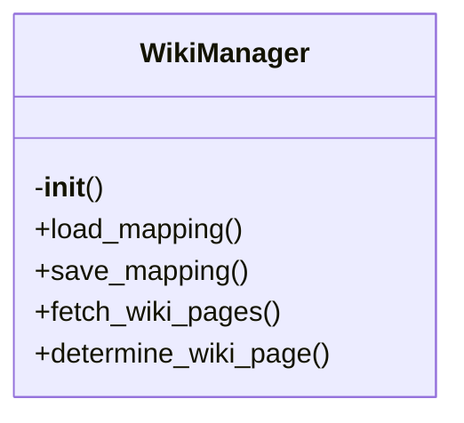

# wiki-manager.py

*Auto-generated from `.github/scripts/wiki-manager.py`*

## 🏗️ Structure



# 📚 `wiki-manager.py` – Smart Wiki Manager

> **TL;DR** – A Python helper that automatically routes documentation files to the correct GitHub Wiki pages, using an LLM for intelligent categorisation and merging. It keeps a persistent mapping, verifies consistency, and produces a concise summary of the wiki organisation.

---

## 1. Overview

`wiki-manager.py` is a command‑line tool that:

| Feature | What it does |
|---------|--------------|
| **Persistent mapping** | Stores a JSON file (`.github/wiki-mapping.json`) that remembers which source file maps to which wiki page. |
| **Wiki page discovery** | Pulls the list of existing wiki pages from the GitHub API. |
| **LLM‑powered routing** | Uses an LLM (default `openai/gpt-oss-120b`) to decide the best wiki page for a file, based on file content, existing pages, and prior mappings. |
| **Content merging** | When a page already exists, the LLM merges new documentation into the existing page, deduplicating and updating timestamps. |
| **Consistency checks** | Validates that the mapping and page metadata are in sync. |
| **Summary generation** | Produces a `wiki_summary.md` that lists all pages, their files, and last‑updated timestamps. |

The script is designed to be run from a GitHub Actions workflow after a PR has been merged. It reads a list of changed source files (`changed_files.txt`), finds the corresponding Markdown docs in `docs/`, and updates the wiki accordingly.

---

## 2. Exports

| Export | Type | Description |
|--------|------|-------------|
| `WikiManager` | Class | Core engine that handles mapping, page discovery, LLM routing, merging, and consistency checks. |
| `process_documentation_to_wiki(doc_files: List[str]) -> List[Dict]` | Function | High‑level entry point that processes a list of Markdown files and returns a list of updates made. |
| `GROQ_API_KEY`, `GITHUB_TOKEN`, `GITHUB_REPO`, `MODEL`, `MAPPING_FILE` | Constants | Environment‑driven configuration values. |

> **Note** – The script is also executable as a script (`__main__`) and will automatically process files listed in `changed_files.txt` when run directly.

---

## 3. Usage Examples

### 3.1. Running the script manually

```bash
# Export required environment variables
export GITHUB_TOKEN="ghp_XXXXXXXXXXXXXXXXXXXX"
export GITHUB_REPOSITORY="owner/repo"
export GROQ_API_KEY="sk-XXXXXXXXXXXXXXXXXXXX"

# Create a list of changed source files (e.g., from a PR)
echo "src/auth.ts" > changed_files.txt
echo "src/database.ts" >> changed_files.txt

# Run the script
python .github/scripts/wiki-manager.py
```

The script will:

1. Read `changed_files.txt`.
2. Find the corresponding Markdown docs in `docs/`.
3. Determine the correct wiki page for each file.
4. Merge or create the wiki pages in the `wiki_updates/` directory.
5. Update the mapping file and generate `wiki_summary.md`.

### 3.2. Using the API in another Python module

```python
from .github_scripts.wiki_manager import WikiManager, process_documentation_to_wiki

# Initialise the manager
manager = WikiManager()

# Determine page for a single file
page = manager.determine_wiki_page('src/auth.ts', open('src/auth.ts').read())
print(f"Auth docs belong in: {page}")

# Update a wiki page directly
content = open('docs/auth.md').read()
manager.update_wiki_page(page, content)

# Save mapping after manual changes
manager.save_mapping()
```

### 3.3. Customising the LLM model

```bash
export LLM_MODEL="gpt-4o-mini"
python .github/scripts/wiki-manager.py
```

The script will now use the specified model for all LLM calls.

---

## 4. Parameters & Return Values

### 4.1. `WikiManager.__init__(self)`

| Parameter | Type | Description |
|-----------|------|-------------|
| None | – | Loads the mapping file and fetches existing wiki pages. |

| Return | Type | Description |
|--------|------|-------------|
| None | – | Instance is ready for use. |

---

### 4.2. `WikiManager.load_mapping(self) -> Dict`

| Parameter | Type | Description |
|-----------|------|-------------|
| None | – | Reads `.github/wiki-mapping.json` if present. |

| Return | Type | Description |
|--------|------|-------------|
| `Dict` | Mapping structure (see class docstring). |

---

### 4.3. `WikiManager.save_mapping(self) -> None`

| Parameter | Type | Description |
|-----------|------|-------------|
| None | – | Writes the current mapping to disk. |

| Return | Type | Description |
|--------|------|-------------|
| None | – | Side‑effect: file written. |

---

### 4.4. `WikiManager.fetch_wiki_pages(self) -> List[str]`

| Parameter | Type | Description |
|-----------|------|-------------|
| None | – | Calls the GitHub Wiki API to list all pages. |

| Return | Type | Description |
|--------|------|-------------|
| `List[str]` | List of page titles. |

---

### 4.5. `WikiManager.determine_wiki_page(self, file_path: str, file_content: str) -> str`

| Parameter | Type | Description |
|-----------|------|-------------|
| `file_path` | `str` | Path to the source file (e.g., `src/auth.ts`). |
| `file_content` | `str` | Full content of the source file (used for LLM context). |

| Return | Type | Description |
|--------|------|-------------|
| `str` | Wiki page name (e.g., `"Authentication-API"`). |

> **Behavior** – If a mapping already exists, it is returned immediately. Otherwise, the LLM is queried with a prompt that includes existing pages, previous mappings, and a set of rules. If the LLM fails or returns an invalid name, a deterministic fallback is used.

---

### 4.6. `WikiManager._fallback_page_name(self, file_path: str) -> str`

| Parameter | Type | Description |
|-----------|------|-------------|
| `file_path` | `str` | Path to the source file. |

| Return | Type | Description |
|--------|------|-------------|
| `str` | Deterministic page name based on heuristics. |

---

### 4.7. `WikiManager.update_wiki_page(self, page_name: str, content: str) -> bool`

| Parameter | Type | Description |
|-----------|------|-------------|
| `page_name` | `str` | Target wiki page title. |
| `content` | `str` | Markdown content to add. |

| Return | Type | Description |
|--------|------|-------------|
| `bool` | `True` if the page file was written to `wiki_updates/`, `False` otherwise. |

> **Note** – The function writes the merged content to `wiki_updates/<page_name>.md`. The actual commit/push is handled by the CI workflow.

---

### 4.8. `WikiManager._merge_wiki_content(self, existing: str, new: str, page_name: str) -> str`

| Parameter | Type | Description |
|-----------|------|-------------|
| `existing` | `str` | Current content of the wiki page (empty if new). |
| `new` | `str` | New documentation to merge. |
| `page_name` | `str` | Wiki page title. |

| Return | Type | Description |
|--------|------|-------------|
| `str` | Merged Markdown content. |

---

### 4.9. `WikiManager._simple_merge(self, existing: str, new: str) -> str`

| Parameter | Type | Description |
|-----------|------|-------------|
| `existing` | `str` | Existing page content. |
| `new` | `str` | New content. |

| Return | Type | Description |
|--------|------|-------------|
| `str` | Concatenated content with updated timestamp. |

---

### 4.10. `WikiManager.record_mapping(self, file_path: str, page_name: str) -> None`

| Parameter | Type | Description |
|-----------|------|-------------|
| `file_path` | `str` | Source file path. |
| `page_name` | `str` | Wiki page title. |

| Return | Type | Description |
|--------|------|-------------|
| None | – | Updates internal mapping and metadata. |

---

### 4.11. `WikiManager.verify_consistency(self) -> bool`

| Parameter | Type | Description |
|-----------|------|-------------
