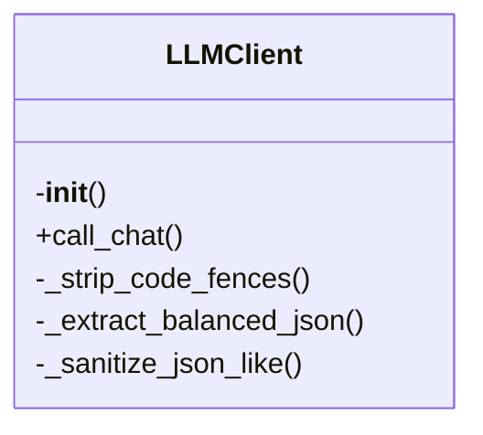

# llm.py

*Auto-generated from `.github/scripts/llm.py`*

# llm.py – LLM Client Library

> **Centralized LLM client with retries, caching, and JSON coercion**  
> This module provides a single, reusable client for calling the Groq (OpenAI‑compatible) API.  
> It handles:
> * Automatic retries with exponential back‑off
> * Local caching of responses (optional)
> * Robust JSON extraction / sanitisation
> * Code‑fence stripping
> * Simple singleton access

> **Why this module?**  
> Many of the repository’s scripts need to call an LLM. Instead of duplicating retry logic, cache handling, and JSON parsing in each script, this module centralises that logic in one place.

---

## 1. Overview

`llm.py` provides a **single, reusable LLM client** that handles:

| Feature | Description |
|---------|-------------|
| **Retries** | 3 attempts with exponential back‑off (1 s, 2 s, 4 s). Retries on 429, 5xx, and timeouts. |
| **Caching** | Responses are cached to `./.llm-cache/<hash>.txt`. Cache key is derived from the request payload. |
| **JSON Coercion** | If `response_format='json'`, the client attempts to parse the response as JSON, stripping code fences, extracting balanced JSON, and sanitising common LLM output errors (smart quotes, trailing commas, multiline strings). |
| **Environment‑aware configuration** | Falls back to `GROQ_*` or `LLM_*` environment variables for API key and endpoint. |
| **Singleton** | `get_client()` returns a shared `LLMClient` instance, so you don’t need to instantiate it yourself. |

### ⚠️ Breaking Changes

- **REMOVED**: Exported function `..., s: str) -> str`
- **REMOVED**: Exported function `text: str) -> str`
- **REMOVED**: Exported function `xt: str) -> str`
- **REMOVED**: Exported function `str) -> str:`
- **REMOVED**: Exported function `tr = None):`
- **REMOVED**: Exported function `elf, text: str) -> Opt`
- **REMOVED**: Exported function `"""Get`

These functions have been removed from the public API. If your code relied on any of them, you will need to refactor to use the remaining `LLMClient` methods.

### 🏗️ Structure



---

## 2. Exports

| Export | Type | Description |
|--------|------|-------------|
| `LLMClient` | Class | Main client for interacting with the LLM. Provides `call_chat`, `_coerce_to_json`, `clear_cache`, etc. |
| `get_client` | Function | Returns a singleton `LLMClient` instance (lazy‑initialised). |
| `GROQ_API_KEY` | Constant | Environment variable key used to fetch the API key. |
| `GROQ_API_URL` | Constant | Default endpoint for Groq chat completions. |
| `CACHE_DIR` | Constant | Path to the local cache directory (`./.llm-cache`). |

> **Note**: Helper methods (`_strip_code_fences`, `_extract_balanced_json`, `_sanitize_json_like`, `_coerce_to_json`, `_fix_json_errors`) are **private** and not part of the public API.

---

## 3. Usage Examples

> **Prerequisites**  
> ```bash
> export GROQ_API_KEY="sk-xxxx"
> pip install requests
> ```

### 3.1 Basic Text Completion

```python
from .llm import get_client

client = get_client()

response = client.call_chat(
    model="gpt-4o-mini",
    messages=[{"role": "user", "content": "Hello, world!"}],
    temperature=0.2,
    max_tokens=50,
)

print(response)  # e.g. "Hello, world!"
```

### 3.2 JSON‑Formatted Response

```python
from .llm import get_client

client = get_client()

json_resp = client.call_chat(
    model="gpt-4o-mini",
    messages=[{"role": "user", "content": "Return a JSON object with a greeting."}],
    response_format="json",
)

print(json_resp)  # e.g. '{"greeting": "Hello, world!"}'
```

### 3.3 Using Cache

```python
from .llm import get_client

client = get_client()

# First call writes to cache
client.call_chat(
    model="gpt-4o-mini",
    messages=[{"role": "user", "content": "What is 2+2?"}],
    use_cache=True,
)

# Subsequent call retrieves from cache
cached = client.call_chat(
    model="gpt-4o-mini",
    messages=[{"role": "user", "content": "What is 2+2?"}],
    use_cache=True,
)

print(cached)  # Cached response
```

---

*Last updated: 2025-12-25*