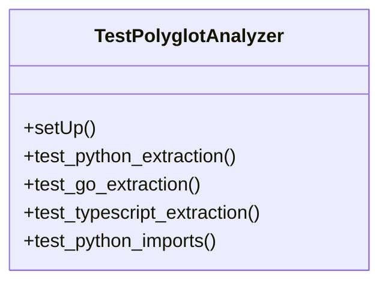

# test_polyglot.py

*Auto-generated from `tests/test_polyglot.py`*

## 🏗️ Structure



# `test_polyglot.py` – API Documentation

> **Note**  
> This file is a **unit‑test suite** for the `PolyglotAnalyzer` class.  
> It is not a library that is imported by other code, but rather a
> collection of test cases that exercise the public API of
> `PolyglotAnalyzer`.  
> The documentation below is aimed at developers who want to understand
> what the tests cover, how to run them, and what the expected
> behaviour of the tested methods is.

---

## 1. Overview

`test_polyglot.py` contains a `unittest.TestCase` subclass that verifies
the correctness of the `PolyglotAnalyzer` class.  
The tests exercise two public methods:

| Method | Purpose |
|--------|---------|
| `extract_symbols(code: str, ext: str) -> List[Dict]` | Parses source code and returns a list of symbol dictionaries (e.g. functions, classes, methods). |
| `extract_imports(code: str, ext: str) -> List[str]` | Parses source code and returns a list of import names (module names, package paths, etc.). |

The test suite covers three languages that the analyzer supports:

* **Python** (`.py`)
* **Go** (`.go`)
* **TypeScript** (`.ts`)

Each language has dedicated tests for symbol extraction and import extraction.

---

## 2. Exports

| Export | Type | Description |
|--------|------|-------------|
| `TestPolyglotAnalyzer` | `unittest.TestCase` subclass | A collection of unit tests that validate the behaviour of `PolyglotAnalyzer`. |

> **Why only a class?**  
> The file is a test module, so the only public symbol is the test
> case class.  The test methods themselves are *private* (prefixed with
> `test_`) and are discovered automatically by the `unittest` framework.

---

## 3. Usage Examples

### 3.1 Running the Tests

```bash
# From the repository root
python -m unittest discover -s .github/scripts/polyglot -p "test_polyglot.py"
```

> The command above will discover the test file and execute all
> `test_*` methods in `TestPolyglotAnalyzer`.

### 3.2 Running a Single Test

```bash
python -m unittest .github/scripts/polyglot.test_polyglot.TestPolyglotAnalyzer.test_python_extraction
```

### 3.3 Using the Test Programmatically

```python
import unittest
loader = unittest.TestLoader()
suite = loader.loadTestsFromTestCase(TestPolyglotAnalyzer)
runner = unittest.TextTestRunner()
runner.run(suite)
```

---

## 4. Parameters

| Method | Parameter | Type | Description |
|--------|-----------|------|-------------|
| `setUp` | *none* | – | Called before each test method to instantiate a fresh `PolyglotAnalyzer`. |
| `test_python_extraction` | *none* | – | Uses a hard‑coded Python snippet. |
| `test_go_extraction` | *none* | – | Uses a hard‑coded Go snippet. |
| `test_typescript_extraction` | *none* | – | Uses a hard‑coded TypeScript snippet. |
| `test_python_imports` | *none* | – | Uses a hard‑coded Python import snippet. |
| `test_ts_imports` | *none* | – | Uses a hard‑coded TypeScript import snippet. |
| `test_go_imports` | *none* | – | Uses a hard‑coded Go import snippet. |

> **All test methods are parameterless** – they use inline source code
> strings that are passed to the analyzer.

---

## 5. Return Values

| Method | Return Value | Meaning |
|--------|--------------|---------|
| `setUp` | *None* | Initializes `self.analyzer`. |
| `test_*` methods | *None* | Each test method asserts conditions; on failure an exception is raised. |
| `PolyglotAnalyzer.extract_symbols` | `List[Dict]` | Each dictionary contains at least a `'name'` key. |
| `PolyglotAnalyzer.extract_imports` | `List[str]` | List of import names (module names, package paths, etc.). |

> The test methods themselves do **not** return values; they rely on
> `unittest` assertions to signal success or failure.

---

## 6. Additional Notes

* **Test Isolation** – `setUp` creates a new `PolyglotAnalyzer` instance for each test, ensuring no state leakage between tests.
* **Assertions** – The tests use `assertIn` to verify that expected symbols or imports appear in the analyzer’s output.  
  If a symbol is missing, the test will fail with an informative message.
* **Language Coverage** – The tests are intentionally minimal; they focus on the most common constructs (functions, classes, methods, imports).  
  If you add support for more languages or new query patterns, extend the test suite accordingly.

---

### TL;DR

`test_polyglot.py` is a straightforward `unittest` module that validates
`PolyglotAnalyzer`’s ability to parse Python, Go, and TypeScript code
for symbols and imports.  Run it with `python -m unittest` and it will
exercise all the test cases automatically.
