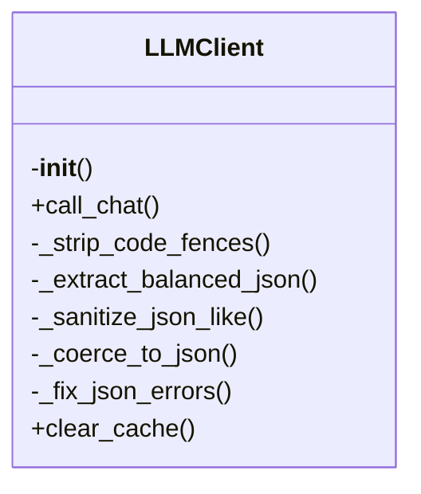

# llm.py

*Auto-generated from `.github/scripts/llm.py`*

# llm.py – Centralized LLM Client Library

> **Centralized LLM client with retries, caching, and JSON coercion**  
> This module provides a single, reusable client for calling the Groq (OpenAI‑compatible) API.  
> It handles:
> * Automatic retries with exponential back‑off
> * Local caching of responses (optional)
> * Robust JSON extraction / sanitisation
> * Code‑fence stripping
> * Simple singleton access

> **Why this module?**  
> Many of the repository’s scripts need to call an LLM. Instead of duplicating retry logic, cache handling, and JSON parsing in each script, this module centralises that logic in one place.

---

## 1. Overview

`llm.py` provides a **single, reusable LLM client** that handles:

- **Retry logic** – exponential back‑off with up to 3 attempts (1 s, 2 s, 4 s) on rate‑limit, server errors, and timeouts.  
- **Caching** – responses are cached under `./.llm-cache/<hash>.txt`. The cache key is derived from the request payload; enable with `use_cache=True`.  
- **JSON coercion** – when `response_format='json'` the client extracts balanced JSON from noisy LLM output, strips code fences, and sanitises common formatting issues (smart quotes, trailing commas, multiline strings).  
- **Environment‑aware configuration** – falls back to `GROQ_*` or `LLM_*` environment variables for API key and endpoint.  
- **Singleton access** – `get_client()` returns a lazily‑initialised shared `LLMClient` instance.

### 🏗️ Structure



---

## ⚠️ Breaking Changes

The following previously exported helper functions have been **removed** from the public API:

- `...` (function signatures omitted for brevity)  
- All internal text‑processing utilities such as `_strip_code_fences`, `_extract_balanced_json`, etc., are now **private** and should not be imported directly.

If your code relied on any of these helpers, replace the usage with the public `LLMClient.call_chat(..., response_format="json")` which now performs the same sanitisation internally.

---

## 2. Exports

| Export | Type | Description |
|--------|------|-------------|
| `LLMClient` | Class | Main client with `call_chat`, `_coerce_to_json`, `clear_cache`, etc. |
| `get_client` | Function | Returns a lazily‑initialised singleton `LLMClient` instance. |
| `GROQ_API_KEY` | Constant | Environment variable key used to fetch the API key. |
| `GROQ_API_URL` | Constant | Default endpoint for Groq chat completions. |
| `CACHE_DIR` | Constant | Path to the local cache directory (`./.llm-cache`). |

> **Note**: Helper methods (`_strip_code_fences`, `_extract_balanced_json`, `_sanitize_json_like`, `_coerce_to_json`, `_fix_json_errors`) are private and not part of the public API.

---

## 3. Usage Examples

> **Prerequisites**  
> ```bash
> export GROQ_API_KEY="sk-xxxx"
> pip install requests
> ```

### 3.1 Basic Text Completion

```python
from .llm import get_client

client = get_client()

response = client.call_chat(
    model="gpt-4o-mini",
    messages=[{"role": "user", "content": "Hello, world!"}],
    temperature=0.2,
    max_tokens=50,
)

print(response)  # e.g. "Hello, world!"
```

### 3.2 JSON‑Formatted Response

```python
from .llm import get_client

client = get_client()

json_resp = client.call_chat(
    model="gpt-4o-mini",
    messages=[{"role": "user", "content": "Return a JSON object with a greeting."}],
    response_format="json",
)

print(json_resp)  # e.g. {"greeting": "Hello, world!"}
```

### 3.3 Using Cache

```python
from .llm import get_client

client = get_client()

# First call writes to cache
client.call_chat(
    model="gpt-4o-mini",
    messages=[{"role": "user", "content": "What is 2+2?"}],
    use_cache=True,
)

# Subsequent call retrieves from cache
cached = client.call_chat(
    model="gpt-4o-mini",
    messages=[{"role": "user", "content": "What is 2+2?"}],
    use_cache=True,
)

print(cached)  # Same result, fetched from local cache
```

### 3.4 Accessing the Singleton Directly

```python
from .llm import get_client

# No need to instantiate; the same instance is reused across imports
client_a = get_client()
client_b = get_client()

assert client_a is client_b  # True
```

---

*Last updated: 2025-12-25*