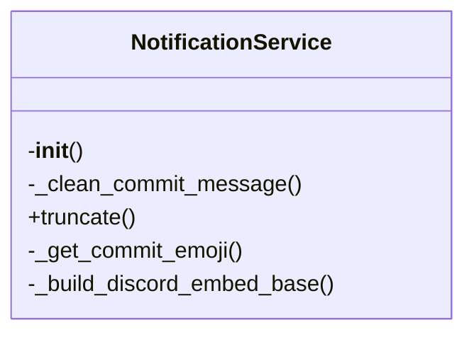

# email-service.ts

*Auto-generated from `./email-service.ts`*

# Email Service Module (`email-service.ts`)

## Overview
The **Email Service** module provides a lightweight, type‑safe API for sending single or bulk emails. It validates recipients, supports plain‑text and HTML bodies, optional CC/BCC, and attachments. The module is intentionally provider‑agnostic – the actual sending logic is abstracted behind `sendViaProvider`, which can be swapped out for a real provider (SendGrid, Mailgun, SES, etc.) in production.

---

## Exports

| Export | Type | Description |
|--------|------|-------------|
| `EmailOptions` | **Interface** | Configuration for a single email. |
| `Attachment` | **Interface** | Represents an email attachment. |
| `EmailResult` | **Interface** | Result of an email send operation. |
| `sendEmail(options: EmailOptions)` | **Async Function** | Sends a single email. |
| `sendBulkEmails(recipients: string[], template: Omit<EmailOptions, 'to'>)` | **Async Function** | Sends the same template to many recipients. |

> **Note:** `isValidEmail` and `sendViaProvider` are internal helpers and not exported.

---

## Usage Examples

### 1. Sending a single email

```ts
import { sendEmail, EmailOptions } from './email-service';

const email: EmailOptions = {
  to: ['alice@example.com', 'bob@example.com'],
  subject: 'Welcome to Our Service',
  body: 'Hello, thanks for joining us!',
  html: '<p>Hello, <strong>thanks</strong> for joining us!</p>',
  cc: ['manager@example.com'],
  attachments: [
    {
      filename: 'terms.pdf',
      content: Buffer.from('PDF content here', 'utf-8'),
      contentType: 'application/pdf',
    },
  ],
};

const result = await sendEmail(email);

if (result.success) {
  console.log(`Email sent! Message ID: ${result.messageId}`);
} else {
  console.error(`Failed to send email: ${result.error}`);
}
```

### 2. Sending bulk emails

```ts
import { sendBulkEmails, EmailOptions } from './email-service';

const recipients = [
  'alice@example.com',
  'bob@example.com',
  'carol@example.com',
];

const template: Omit<EmailOptions, 'to'> = {
  subject: 'Monthly Newsletter',
  body: 'Here is our monthly newsletter.',
  html: '<h1>Monthly Newsletter</h1><p>Enjoy!</p>',
};

const results = await sendBulkEmails(recipients, template);

results.forEach((res, idx) => {
  if (res.success) {
    console.log(`Email ${idx + 1} sent: ${res.messageId}`);
  } else {
    console.warn(`Email ${idx + 1} failed: ${res.error}`);
  }
});
```

### 3. Handling errors

```ts
try {
  const result = await sendEmail({
    to: ['invalid-email'],
    subject: 'Test',
    body: 'Hello',
  });

  if (!result.success) {
    throw new Error(result.error);
  }
} catch (err) {
  console.error('Email send error:', err);
}
```

---

## Parameters

### `sendEmail(options: EmailOptions)`

| Parameter | Type | Description |
|-----------|------|-------------|
| `options` | `EmailOptions` | Email configuration object. |
| `options.to` | `string[]` | **Required.** List of primary recipients. |
| `options.subject` | `string` | **Required.** Email subject line. |
| `options.body` | `string` | **Required.** Plain‑text body. |
| `options.html` | `string` | Optional HTML body. |
| `options.cc` | `string[]` | Optional CC recipients. |
| `options.bcc` | `string[]` | Optional BCC recipients. |
| `options.attachments` | `Attachment[]` | Optional list of attachments. |

### `sendBulkEmails(recipients: string[], template: Omit<EmailOptions, 'to'>)`

| Parameter | Type | Description |
|-----------|------|-------------|
| `recipients` | `string[]` | Array of email addresses to send to. |
| `template` | `Omit<EmailOptions, 'to'>` | Email template excluding the `to` field; will be applied to each recipient. |

---

## Return Values

### `sendEmail`

Returns a `Promise<EmailResult>`:

| Property | Type | Description |
|----------|------|-------------|
| `success` | `boolean` | `true` if the email was queued/sent successfully. |
| `messageId` | `string | undefined` | Identifier returned by the provider (e.g., `msg_123456`). Only present on success. |
| `error` | `string | undefined` | Human‑readable error message on failure. |

### `sendBulkEmails`

Returns a `Promise<EmailResult[]>` – an array of results, one per recipient, preserving order.

---

## Internal Helpers (Not Exported)

| Function | Purpose |
|----------|---------|
| `isValidEmail(email: string): boolean` | Simple regex validation of email addresses. |
| `sendViaProvider(options: EmailOptions): Promise<string>` | Simulated provider call; returns a fake message ID. Replace with real API integration. |

---

## Extending / Customizing

- **Provider Integration**: Replace `sendViaProvider` with your provider SDK (SendGrid, SES, etc.). Ensure it returns a unique message ID string.
- **Validation**: Enhance `isValidEmail` with stricter checks or use a library like `validator.js`.
- **Error Handling**: Wrap `sendEmail` calls in try/catch if you prefer exceptions over `EmailResult.error`.

---

## Summary

The `email-service.ts` module offers a clean, typed API for sending emails, handling validation, attachments, and bulk dispatch. It returns structured results that make error handling straightforward, and it can be easily swapped for real provider logic.


# send-notifications.py

*Auto-generated from `.github/scripts/send-notifications.py`*

## 🏗️ Structure



# 📦 `send-notifications.py`

> **Notification Service** – a lightweight Python helper that reads CI workflow artifacts and posts a nicely‑formatted update to Discord, Slack, or Pushbullet.  
> It handles character limits, emoji selection, and optional code‑analysis summaries.

---

## 1. Overview

The script is designed to run as a GitHub Actions step (or locally) after a workflow has finished.  
It:

1. **Collects** data from workflow artifacts (`changed_files.txt`, `breaking_changes.txt`, `wiki_summary.md`, `doc_output.md`, `analysis_results.json`).
2. **Builds** a rich notification payload for each platform.
3. **Posts** the payload to the configured webhook / API token.

> **Why this file?**  
> Instead of sending raw JSON or plain text, the service formats messages with emojis, embeds, and Slack blocks, ensuring that notifications stay readable even when the commit touches many files or introduces breaking changes.

---

## 2. Exports

| Export | Type | Description |
|--------|------|-------------|
| `NotificationService` | **class** | Main helper that builds and sends notifications. |
| `load_workflow_data()` | **function** | Reads artifact files and returns a dictionary of parsed data. |
| `main()` | **function** | CLI entry‑point that orchestrates data loading and notification sending. |

> **Constants** (module‑level) are also available for reference:  
> `DISCORD_WEBHOOK`, `SLACK_WEBHOOK`, `PUSHBULLET_TOKEN`, `DISCORD_CONTENT_LIMIT`, etc.

---

## 3. Usage Examples

> **Prerequisites** – set the following environment variables in your workflow or shell:  
> ```bash
> export DISCORD_WEBHOOK_URL="https://discord.com/api/webhooks/..."
> export SLACK_WEBHOOK_URL="https://hooks.slack.com/services/..."
> export PUSHBULLET="YOUR_PUSHBULLET_TOKEN"
> ```

### 3.1 Using the CLI (`main`)

```bash
# In a GitHub Actions step
- name: Send notifications
  run: python .github/scripts/send-notifications.py
```

The script will automatically:

1. Load the commit message via `git log`.
2. Parse artifacts.
3. Send notifications to all configured platforms.

### 3.2 Using the API in Python

```python
from pathlib import Path
from send_notifications import NotificationService, load_workflow_data

# 1. Load data (e.g. from a CI run)
data = load_workflow_data()

# 2. Create the service
service = NotificationService()

# 3. Send to Discord
service.send_discord(
    changed_files=data['changed_files'],
    breaking_changes=data['breaking_changes'],
    changelog_entries=data['changelog_entries'],
    wiki_pages=data['wiki_pages'],
    analysis_summary=data.get('analysis_summary')
)

# 4. Send to Slack
service.send_slack(
    changed_files=data['changed_files'],
    breaking_changes=data['breaking_changes'],
    changelog_entries=data['changelog_entries'],
    wiki_pages=data['wiki_pages'],
    analysis_summary=data.get('analysis_summary')
)
```

> **Tip** – If you only want to send to a single platform, simply call the corresponding method.

---

## 4. Parameters & Return Values

### 4.1 `NotificationService`

| Method | Parameters | Description | Return Value |
|--------|------------|-------------|--------------|
| `__init__()` | – | Initializes context from environment variables (`GITHUB_*`). | `None` |
| `truncate(text, limit)` | `text: str`, `limit: int` | Truncates `text` to `limit` characters, adding `...` if needed. | `str` |
| `_clean_commit_message(message)` | `message: str` | Removes Kynlo‑specific metadata lines. | `str` |
| `_get_commit_emoji(breaking_changes)` | `breaking_changes: List[Dict]` | Returns an emoji based on commit type or breaking changes. | `str` |
| `_build_discord_embed_base(emoji)` | `emoji: str` | Builds the base embed dictionary. | `Dict` |
| `_add_breaking_changes_field(embed, breaking_changes)` | `embed: Dict`, `breaking_changes: List[Dict]` | Adds a “Breaking Changes” field if any. | `None` |
| `_add_files_field(embed, changed_files)` | `embed: Dict`, `changed_files: List[str]` | Adds a “Files Changed” field. | `None` |
| `_add_wiki_field(embed, wiki_pages)` | `embed: Dict`, `wiki_pages: List[str]` | Adds a “Wiki Pages Updated” field. | `None` |
| `_add_analysis_field(embed, analysis_summary)` | `embed: Dict`, `analysis_summary: Optional[Dict]` | Adds a “Code Analysis” field. | `None` |
| `send_discord(...)` | `changed_files: List[str]`, `breaking_changes: List[Dict]`, `changelog_entries: List[Dict]`, `wiki_pages: List[str]`, `analysis_summary: Optional[Dict]` | Builds and posts a Discord embed. | `bool` – `True` if HTTP 204, else `False` |
| `send_slack(...)` | Same parameters as `send_discord` | Builds and posts a Slack message. | `bool` – `True` if HTTP 200, else `False` |
| `send_pushbullet(...)` | Same parameters as `send_discord` | Builds and posts a Pushbullet link push. | `bool` – `True` if HTTP 200/201, else `False` |
| `_build_slack_blocks(...)` | `emoji: str`, `commit_title: str`, `breaking_changes: List[Dict]`, `changed_files: List[str]`, `wiki_pages: List[str]`, `analysis_summary: Optional[Dict]` | Returns a list of Slack block objects. | `List[Dict]` |

### 4.2 `load_workflow_data()`

| Parameter | Description | Return Value |
|-----------|-------------|--------------|
| – | Reads artifact files in the current working directory. | `Dict[str, Any]` – keys: `changed_files`, `breaking_changes`, `changelog_entries`, `wiki_pages`, `analysis_summary` |

> **`analysis_summary`** (if present) has the shape:  
> ```json
> {
>   "files_analyzed": 12,
>   "avg_quality_score": 87.5,
>   "total_vulnerabilities": 3,
>   "total_performance_issues": 1,
>   "details": [ ... ]   // raw analysis data
> }
> ```

### 4.3 `main()`

| Parameter | Description | Return Value |
|-----------|-------------|--------------|
| – | Orchestrates the whole notification flow. | `None` (prints status to stdout) |

---

## 5. Common Patterns

| Scenario | How to handle |
|----------|---------------|
| **No webhook configured** | The script prints a warning and skips that platform. |
| **Large number of changed files** | Only the first 10 are shown in Discord; first 5 in Slack. |
| **Breaking changes** | Emoji `⚠️` is used; a dedicated field lists up to 5 changes. |
| **Code analysis present** | Adds a “Code Analysis” field with quality score, security and performance counts. |
| **Pushbullet** | Sends a link push with a short body; useful for mobile alerts. |

---

## 6. Extending the Service

- **Add a new platform** – create a method similar to `send_discord` that builds a payload and POSTs to its API.
- **Custom emoji logic** – modify `_get_commit_emoji`.
- **Different field limits** – adjust `DISCORD_*_LIMIT` constants.

---

## 7. License & Credits

This file is part of the **Kynlo Akari** CI tooling.  
Feel free to adapt or fork; just keep the MIT license header if you modify it.

# send-notifications.py

*Auto-generated from `.github/scripts/send-notifications.py`*

## 🏗️ Structure


# 📦 `send-notifications.py`

> **Notification Service** – a lightweight Python helper that reads CI workflow artifacts and posts a nicely‑formatted update to Discord, Slack, or Pushbullet.  
> It handles character limits, emoji selection, and optional code‑analysis summaries.

---

## 1. Overview

The script is designed to run as a GitHub Actions step (or locally) after a workflow has finished.  
It:

1. **Collects** data from workflow artifacts (`changed_files.txt`, `breaking_changes.txt`, `wiki_summary.md`, `doc_output.md`, `analysis_results.json`).
2. **Builds** a rich notification payload for each platform.
3. **Posts** the payload to the configured webhook / API token.

> **Why this file?**  
> Instead of sending raw JSON or plain text, the service formats messages with emojis, embeds, and Slack blocks, ensuring that notifications stay readable even when the commit touches many files or introduces breaking changes.

---

## 2. Exports

| Export | Type | Description |
|--------|------|-------------|
| `NotificationService` | **class** | Main helper that builds and sends notifications. |
| `load_workflow_data()` | **function** | Reads artifact files and returns a dictionary of parsed data. |
| `main()` | **function** | CLI entry‑point that orchestrates data loading and notification sending. |

> **Constants** (module‑level) are also available for reference:  
> `DISCORD_WEBHOOK`, `SLACK_WEBHOOK`, `PUSHBULLET_TOKEN`, `DISCORD_CONTENT_LIMIT`, etc.

---

## 3. Usage Examples

> **Prerequisites** – set the following environment variables in your workflow or shell:  
> ```bash
> export DISCORD_WEBHOOK_URL="https://discord.com/api/webhooks/..."
> export SLACK_WEBHOOK_URL="https://hooks.slack.com/services/..."
> export PUSHBULLET="YOUR_PUSHBULLET_TOKEN"
> ```

### 3.1 Using the CLI (`main`)

```bash
# In a GitHub Actions step
- name: Send notifications
  run: python .github/scripts/send-notifications.py
```

The script will automatically:

1. Load the commit message via `git log`.
2. Parse artifacts.
3. Send notifications to all configured platforms.

### 3.2 Using the API in Python

```python
from pathlib import Path
from send_notifications import NotificationService, load_workflow_data

# 1. Load data (e.g. from a CI run)
data = load_workflow_data()

# 2. Create the service
service = NotificationService()

# 3. Send to Discord
service.send_discord(
    changed_files=data['changed_files'],
    breaking_changes=data['breaking_changes'],
    changelog_entries=data['changelog_entries'],
    wiki_pages=data['wiki_pages'],
    analysis_summary=data.get('analysis_summary')
)

# 4. Send to Slack
service.send_slack(
    changed_files=data['changed_files'],
    breaking_changes=data['breaking_changes'],
    changelog_entries=data['changelog_entries'],
    wiki_pages=data['wiki_pages'],
    analysis_summary=data.get('analysis_summary')
)
```

> **Tip** – If you only want to send to a single platform, simply call the corresponding method.

---

## 4. Parameters & Return Values

### 4.1 `NotificationService`

| Method | Parameters | Description | Return Value |
|--------|------------|-------------|--------------|
| `__init__()` | – | Initializes context from environment variables (`GITHUB_*`). | `None` |
| `truncate(text, limit)` | `text: str`, `limit: int` | Truncates `text` to `limit` characters, adding `...` if needed. | `str` |
| `_clean_commit_message(message)` | `message: str` | Removes Kynlo‑specific metadata lines. | `str` |
| `_get_commit_emoji(breaking_changes)` | `breaking_changes: List[Dict]` | Returns an emoji based on commit type or breaking changes. | `str` |
| `_build_discord_embed_base(emoji)` | `emoji: str` | Builds the base embed dictionary. | `Dict` |
| `_add_breaking_changes_field(embed, breaking_changes)` | `embed: Dict`, `breaking_changes: List[Dict]` | Adds a “Breaking Changes” field if any. | `None` |
| `_add_files_field(embed, changed_files)` | `embed: Dict`, `changed_files: List[str]` | Adds a “Files Changed” field. | `None` |
| `_add_wiki_field(embed, wiki_pages)` | `embed: Dict`, `wiki_pages: List[str]` | Adds a “Wiki Pages Updated” field. | `None` |
| `_add_analysis_field(embed, analysis_summary)` | `embed: Dict`, `analysis_summary: Optional[Dict]` | Adds a “Code Analysis” field. | `None` |
| `send_discord(...)` | `changed_files: List[str]`, `breaking_changes: List[Dict]`, `changelog_entries: List[Dict]`, `wiki_pages: List[str]`, `analysis_summary: Optional[Dict]` | Builds and posts a Discord embed. | `bool` – `True` if HTTP 204, else `False` |
| `send_slack(...)` | Same parameters as `send_discord` | Builds and posts a Slack message. | `bool` – `True` if HTTP 200, else `False` |
| `send_pushbullet(...)` | Same parameters as `send_discord` | Builds and posts a Pushbullet link push. | `bool` – `True` if HTTP 200/201, else `False` |
| `_build_slack_blocks(...)` | `emoji: str`, `commit_title: str`, `breaking_changes: List[Dict]`, `changed_files: List[str]`, `wiki_pages: List[str]`, `analysis_summary: Optional[Dict]` | Returns a list of Slack block objects. | `List[Dict]` |

### 4.2 `load_workflow_data()`

| Parameter | Description | Return Value |
|-----------|-------------|--------------|
| – | Reads artifact files in the current working directory. | `Dict[str, Any]` – keys: `changed_files`, `breaking_changes`, `changelog_entries`, `wiki_pages`, `analysis_summary` |

> **`analysis_summary`** (if present) has the shape:  
> ```json
> {
>   "files_analyzed": 12,
>   "avg_quality_score": 87.5,
>   "total_vulnerabilities": 3,
>   "total_performance_issues": 1,
>   "details": [ ... ]   // raw analysis data
> }
> ```

### 4.3 `main()`

| Parameter | Description | Return Value |
|-----------|-------------|--------------|
| – | Orchestrates the whole notification flow. | `None` (prints status to stdout) |

---

## 5. Common Patterns

| Scenario | How to handle |
|----------|---------------|
| **No webhook configured** | The script prints a warning and skips that platform. |
| **Large number of changed files** | Only the first 10 are shown in Discord; first 5 in Slack. |
| **Breaking changes** | Emoji `⚠️` is used; a dedicated field lists up to 5 changes. |
| **Code analysis present** | Adds a “Code Analysis” field with quality score, security and performance counts. |
| **Pushbullet** | Sends a link push with a short body; useful for mobile alerts. |

---

## 6. Extending the Service

- **Add a new platform** – create a method similar to `send_discord` that builds a payload and POSTs to its API.
- **Custom emoji logic** – modify `_get_commit_emoji`.
- **Different field limits** – adjust `DISCORD_*_LIMIT` constants.

---

## 7. License & Credits

This file is part of the **Kynlo Akari** CI tooling.  
Feel free to adapt or fork; just keep the MIT license header if you modify it.