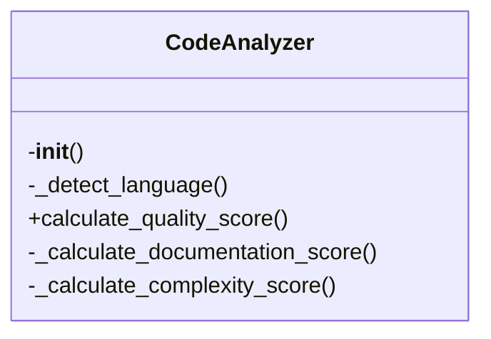

# code-analyzer.py

*Auto-generated from `.github/scripts/code-analyzer.py`*

## ⚠️ Breaking Changes

- **REMOVED**: Removed exported class: ASTAnalyzer
- **REMOVED**: Removed exported function: visit_AsyncFunctionDef
- **REMOVED**: Removed exported function: visit_FunctionDef
- **REMOVED**: Removed exported function: visit_ClassDef
- **REMOVED**: Removed exported function: visit_If
- **REMOVED**: Removed exported function: visit_For
- **REMOVED**: Removed exported function: visit_While
- **REMOVED**: Removed exported function: analyze
- **REMOVED**: Removed exported function: visit_Try
- **REMOVED**: Removed exported function: visit_ExceptHandler
## 🏗️ Structure



# Advanced Code Analyzer – API Documentation

> **Location**: `.github/scripts/code-analyzer.py`  
> **Purpose**: A multi‑language static analysis tool that produces a quality score, scans for security vulnerabilities, and flags performance issues.

---

## 1. Overview

The script is a **stand‑alone CLI** and **Python API** that:

| Feature | What it does |
|---------|--------------|
| **Quality Scoring** | Computes a 0‑100 score split into documentation, complexity, and maintainability. |
| **Security Scanning** | Looks for patterns defined in `config/languages.json` (e.g., SQL injection, command injection). |
| **Performance Detection** | Flags regex‑based patterns and large functions (via Polyglot). |
| **Polyglot Integration** | Uses `PolyglotAnalyzer` to extract language‑agnostic symbols (functions, classes, etc.). |
| **Config Driven** | Loads language‑specific settings from `config/languages.json`. |

The script can be invoked directly (`python code-analyzer.py`) or imported into other Python code.

---

## 2. Exports

| Export | Type | Description |
|--------|------|-------------|
| `load_config()` | `function` | Loads `languages.json` into global dictionaries. |
| `CodeAnalyzer` | `class` | Main analyzer that performs all checks. |
| `analyze_file(file_path: str) -> Optional[Dict]` | `function` | Convenience wrapper that reads a file, runs `CodeAnalyzer`, and returns a result dict. |
| `main()` | `function` | CLI entry point – parses changed files, runs analysis, writes JSON output. |

> **Note**: `main()` is executed when the script is run as `__main__`. It is not intended to be imported.

---

## 3. Usage Examples

### 3.1 CLI

```bash
# Run the analyzer on the current repo
python .github/scripts/code-analyzer.py
```

The script expects a `changed_files.txt` file listing the files to analyze. It outputs a JSON file under `code-analysis/<timestamp>_<sha>/results.json`.

### 3.2 Importing as a Library

```python
from .github.scripts.code_analyzer import analyze_file, CodeAnalyzer, load_config

# Load configuration once
load_config()

# Analyze a single file
result = analyze_file('src/main.py')
print(result['quality_score']['total'])  # 78

# Use the class directly
with open('src/main.py', 'r', encoding='utf-8') as f:
    content = f.read()

analyzer = CodeAnalyzer('src/main.py', content)
print(analyzer.calculate_quality_score())
print(analyzer.scan_security_vulnerabilities())
print(analyzer.detect_performance_issues())
```

---

## 4. Parameters & Return Values

### 4.1 `load_config()`

| Parameter | Type | Description | Default |
|-----------|------|-------------|---------|
| None | – | – | – |

**Return**: `None` – sets global dictionaries `LANGUAGE_CONFIG`, `SECURITY_PATTERNS`, `PERFORMANCE_PATTERNS`.

---

### 4.2 `CodeAnalyzer`

| Method | Parameters | Description | Return Value |
|--------|------------|-------------|--------------|
| `__init__(self, file_path: str, content: str)` | `file_path`, `content` | Initializes analyzer, detects language, extracts symbols via `PolyglotAnalyzer`. | `None` |
| `_detect_language(self) -> str` | – | Detects language key from file extension. | `str` (e.g., `'python'` or `'unknown'`) |
| `calculate_quality_score(self) -> Dict` | – | Computes overall quality score and breakdown. | `{ 'total': int, 'grade': str, 'documentation': int, 'complexity': int, 'maintainability': int, 'breakdown': Dict }` |
| `_calculate_documentation_score(self) -> int` | – | Internal helper for documentation coverage. | `int` (0‑30) |
| `_calculate_complexity_score(self) -> int` | – | Internal helper for complexity. | `int` (0‑30) |
| `_calculate_maintainability_score(self) -> int` | – | Internal helper for maintainability. | `int` (0‑40) |
| `_get_documentation_details(self) -> Dict` | – | Returns list of missing docs. | `{ 'missing': List[str], 'count': int }` |
| `_get_complexity_details(self) -> List[str]` | – | Returns notes about complexity. | `List[str]` |
| `_get_maintainability_details(self) -> List[str]` | – | Returns notes about maintainability. | `List[str]` |
| `_get_average_function_length(self) -> float` | – | Computes average function length. | `float` |
| `_get_grade(self, score: int) -> str` | `score` | Maps numeric score to letter grade. | `str` |
| `scan_security_vulnerabilities(self) -> List[Dict]` | – | Scans for security patterns. | `List[Dict]` – each dict contains `category`, `severity`, `description`, `line`, `code`. |
| `detect_performance_issues(self) -> List[Dict]` | – | Detects performance patterns and large functions. | `List[Dict]` – each dict contains `type`, `severity`, `description`, `line`, `suggestion`. |

---

### 4.3 `analyze_file(file_path: str) -> Optional[Dict]`

| Parameter | Type | Description |
|-----------|------|-------------|
| `file_path` | `str` | Path to the file to analyze. |

**Return**: `None` if the file does not exist or cannot be read; otherwise a dictionary:

```json
{
  "file": "src/main.py",
  "language": "python",
  "quality_score": { ... },
  "security_vulnerabilities": [ ... ],
  "performance_issues": [ ... ]
}
```

---

### 4.4 `main()`

No parameters. Reads `changed_files.txt`, runs analysis on supported files, writes a JSON report to `code-analysis/<timestamp>_<sha>/results.json`.

---

## 5. Configuration (`config/languages.json`)

The analyzer relies on a JSON config that maps language keys to:

```json
{
  "languages": {
    "python": {
      "extensions": [".py"],
      "comment_single": ["#"],
      "complexity_keywords": ["if", "for", "while", "try", "except"]
    },
    "javascript": {
      "extensions": [".js", ".jsx"],
      "comment_single": ["//"],
      "complexity_keywords": ["if", "for", "while", "switch", "case", "try", "catch"]
    }
  },
  "security_patterns": {
    "sql_injection": [
      ["SELECT\\s+.*\\s+FROM\\s+.*", "Potential SQL injection"]
    ],
    "command_injection": [
      ["system\\s*\\(", "Potential command injection"]
    ]
  },
  "performance_patterns": {
    "nested_loops": "for\\s+.*\\n\\s*for\\s+.*",
    "heavy_regex": "re\\.findall\\s*\\("
  }
}
```

> **Tip**: Add new patterns or language extensions by editing this file; the script will pick them up on the next run.

---

## 6. Extending the Analyzer

1. **Add a new language** – Update `languages` section with extensions and optional `comment_single` / `complexity_keywords`.  
2. **Add a security pattern** – Append to `security_patterns` with a regex and description.  
3. **Add a performance pattern** – Append to `performance_patterns` with a regex.  
4. **Improve Polyglot** – If you need end line numbers, modify `polyglot_analyzer.extract_symbols` to return `end_line`.

---

## 7. Common Pitfalls

| Issue | Symptom | Fix |
|-------|---------|-----|
| `load_config()` never called | Global dicts are empty → analyzer reports `unknown` language | Call `load_config()` before creating `CodeAnalyzer` (CLI does this automatically). |
| `PolyglotAnalyzer` missing `end_line` | Large function detection inaccurate | Update `PolyglotAnalyzer` to return `