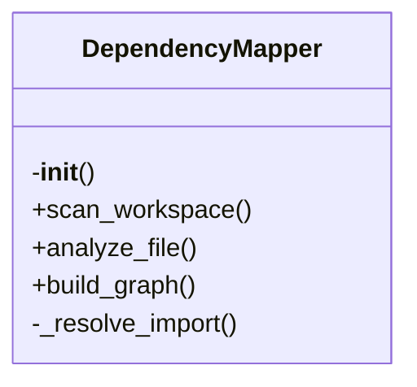

# dependency_mapper.py

*Auto-generated from `.github/scripts/polyglot/dependency_mapper.py`*

## 🏗️ Structure



# `dependency_mapper.py`

A lightweight utility for building a **dependency graph** across a multi‑language codebase.  
It walks a workspace, extracts imports and symbols from supported files, and resolves those imports to concrete file paths. The result is a mapping from each file to the files it depends on.

> **Supported file types**: `*.py`, `*.js`, `*.ts`, `*.tsx`, `*.go`, `*.rs`, `*.java`

> **Dependencies**:  
> * `PolyglotAnalyzer` – a helper that knows how to pull imports and symbols from the different languages.

---

## Exports

| Export | Type | Description |
|--------|------|-------------|
| `DependencyMapper` | **class** | Main entry point. Handles scanning, analysis, and graph construction. |

> *Note*: The module imports `PolyglotAnalyzer` but does **not** expose it.

---

## Overview

`DependencyMapper` is designed for static analysis of a codebase that contains multiple programming languages.  
It performs the following steps:

1. **Scan** the workspace for supported files.  
2. **Analyze** each file to extract:
   * Import statements (as strings).  
   * Declared symbols (functions, classes, etc.).  
3. **Build** a dependency graph where each node is a file and edges point to the files it imports.

The resulting graph can be used for visualisation, impact analysis, or as a foundation for more advanced tooling (e.g., refactoring, code‑coverage mapping).

---

## Class: `DependencyMapper`

```python
class DependencyMapper:
    def __init__(self, workspace_root: str | Path)
    def scan_workspace(self) -> None
    def analyze_file(self, file_path: Path) -> None
    def build_graph(self) -> Dict[str, List[str]]
    def _resolve_import(self, import_str: str, source_file: str) -> Optional[str]
```

### Constructor

```python
DependencyMapper(workspace_root)
```

| Parameter | Type | Description |
|-----------|------|-------------|
| `workspace_root` | `str` or `Path` | Absolute or relative path to the root of the workspace you want to analyse. |

| Attribute | Description |
|-----------|-------------|
| `root` | `Path` – Normalised absolute path to the workspace root. |
| `analyzer` | `PolyglotAnalyzer` – Helper for language‑specific parsing. |
| `file_map` | `dict` – Maps a **relative** file path (POSIX style) to its imports, symbols, and absolute path. |
| `dependency_graph` | `dict` – Maps a file to a list of resolved dependency paths. |

---

### `scan_workspace()`

Recursively walks `self.root`, finds supported files, and calls `analyze_file` on each.

| Parameters | None |
|------------|------|
| **Returns** | `None` – side‑effect: populates `self.file_map`. |

> **Example**

```python
mapper = DependencyMapper("/path/to/project")
mapper.scan_workspace()
print(mapper.file_map)  # { "src/main.py": {...}, "src/app.ts": {...} }
```

---

### `analyze_file(file_path)`

Parses a single file, extracts imports and symbols, and stores the result in `self.file_map`.

| Parameter | Type | Description |
|-----------|------|-------------|
| `file_path` | `Path` | Absolute path to the file to analyse. |

| Returns | Type | Description |
|---------|------|-------------|
| `None` | | The method updates `self.file_map`. |

> **Example**

```python
mapper.analyze_file(Path("/path/to/project/src/main.py"))
print(mapper.file_map["src/main.py"])
# {
#   'imports': ['os', 'sys'],
#   'symbols': ['main', 'helper'],
#   'path': '/path/to/project/src/main.py'
# }
```

---

### `