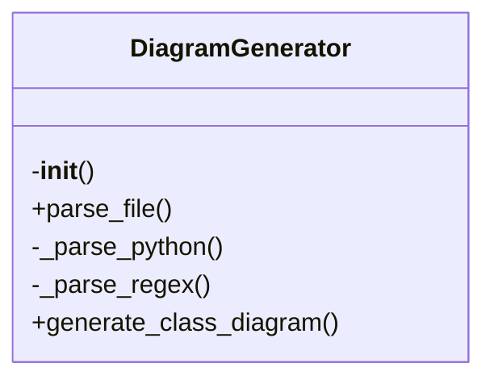

# diagram_generator.py

*Auto-generated from `.github/scripts/diagram_generator.py`*

## 🏗️ Structure



# Diagram Generator API Documentation

## Overview

`diagram_generator.py` is a lightweight utility that parses source files and generates **Mermaid.js** class diagrams.  
It supports:

- **Python** files (via the `ast` module)
- **TypeScript / JavaScript / Java / C# / C++** files (via simple regex heuristics)

The generated diagram can be pasted into any Mermaid‑enabled editor (e.g., Markdown preview, VS Code, or the Mermaid Live Editor) to visualize class hierarchies, methods, and properties.

---

## Exports

| Export | Type | Description |
|--------|------|-------------|
| `DiagramGenerator` | Class | Main API for parsing files and producing Mermaid diagrams. |
| `main` | Function | CLI entry point that accepts a file path and prints the diagram. |

---

## Usage Examples

### 1. Using the `DiagramGenerator` class in code

```python
from diagram_generator import DiagramGenerator

# Create a generator instance
generator = DiagramGenerator()

# Read a Python file
with open('example.py', 'r', encoding='utf-8') as f:
    content = f.read()

# Parse the file
generator.parse_file('example.py', content)

# Generate the Mermaid diagram
mermaid = generator.generate_class_diagram()
print(mermaid)
```

### 2. Using the CLI

```bash
# Generate a diagram for a TypeScript file
python diagram_generator.py src/app.ts
```

The script will output something like:

```
classDiagram
    class User {
        +id
        +name
        +email
        +save()
    }
    class BaseModel {
        +createdAt
        +updatedAt
    }
    BaseModel <|-- User
```

---

## API Reference

### `class DiagramGenerator`

#### `__init__(self) -> None`

Initializes an empty diagram model.

- **Parameters**: None
- **Return Value**: `None`

#### `parse_file(self, file_path: str, content: str) -> None`

Detects the file type by extension and delegates parsing to the appropriate method.

- **Parameters**:
  - `file_path`: Path to the source file (used only for extension detection).
  - `content`: Raw file content as a string.
- **Return Value**: `None`

#### `generate_class_diagram(self) -> str`

Renders the collected class information into a Mermaid class diagram string.

- **Parameters**: None
- **Return Value**: A string containing the Mermaid diagram. Returns an empty string if no classes were parsed.

#### `_parse_python(self, content: str) -> None`

Internal helper that parses Python source using the `ast` module.

- **Parameters**:
  - `content`: Raw Python source code.
- **Return Value**: `None`

#### `_parse_regex(self, content: str) -> None`

Internal helper that parses non‑Python files using regular expressions.

- **Parameters**:
  - `content`: Raw source code of a supported language.
- **Return Value**: `None`

### `main() -> None`

Command‑line interface that:

1. Expects a single argument: the path to a source file.
2. Reads the file, parses it, and prints the Mermaid diagram.

- **Parameters**: None (reads from `sys.argv`)
- **Return Value**: `None`

---

## Parameter & Return Value Details

| Function | Parameter | Type | Description |
|----------|-----------|------|-------------|
| `parse_file` | `file_path` | `str` | Full path to the file; used only for extension detection. |
| | `content` | `str` | Entire file content. |
| `generate_class_diagram` | None | | Generates Mermaid syntax. |
| `main` | None | | Prints diagram to stdout. |

| Return Value | Description |
|--------------|-------------|
| `DiagramGenerator.__init__` | None |
| `DiagramGenerator.parse_file` | None |
| `DiagramGenerator.generate_class_diagram` | `str` – Mermaid diagram or empty string. |
| `DiagramGenerator._parse_python` | None |
| `DiagramGenerator._parse_regex` | None |
| `main` | None |

---

## Notes & Limitations

- **Python Parsing**: Only class names, inheritance, public/private methods, and annotated properties are extracted. Dynamic features (metaclasses, decorators) are ignored.
- **Regex Parsing**: Very lightweight; only detects `class <Name> extends <Base>` patterns and ignores method bodies. It may miss nested classes or interfaces.
- **Property Visibility**: For Python, all properties are shown as public (`+`). For other languages, properties are omitted to avoid noise.
- **Diagram Size**: The generator limits displayed members to the first 5 methods/properties per class to keep diagrams readable.

---

Feel free to extend the regex patterns or the AST traversal to support more languages or richer class features. Happy diagramming!