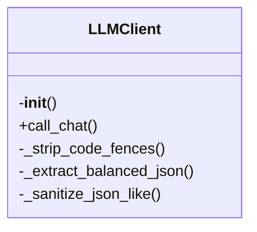

# llm.py

*Auto-generated from `.github/scripts/llm.py`*

## ⚠️ Breaking Changes

- **REMOVED**: Removed exported function: , s: str) -> str:
 
- **REMOVED**: Removed exported function:  text: str) -> str
- **REMOVED**: Removed exported function: xt: str) -> str
- **REMOVED**: Removed exported function:  str) -> str:
  
- **REMOVED**: Removed exported function: tr = None):
- **REMOVED**: Removed exported function: elf, text: str) -> Opt
- **REMOVED**: Removed exported function:    """Get 
## 🏗️ Structure



# llm.py – Centralized LLM Client

## Overview
`llm.py` provides a **single, reusable LLM client** that handles:

- **Retry logic** (exponential back‑off, up to 3 attempts)
- **Caching** of responses in a local `.llm-cache` directory
- **JSON coercion** – automatically extracts and sanitises JSON from noisy LLM output
- **Environment‑aware configuration** – falls back to `GROQ_*` or `LLM_*` env vars
- **Convenient singleton** access via `get_client()`

It is designed to be dropped into any script that needs to talk to an OpenAI‑compatible API (e.g., Groq, OpenAI, Anthropic) without duplicating boilerplate.

---

## Exports

| Export | Type | Description |
|--------|------|-------------|
| `LLMClient` | Class | Main client with `call_chat`, `_coerce_to_json`, `clear_cache`, etc. |
| `get_client` | Function | Returns a singleton `LLMClient` instance (lazy‑initialised). |

> **Note**: All helper methods (`_strip_code_fences`, `_extract_balanced_json`, `_sanitize_json_like`, `_coerce_to_json`, `_fix_json_errors`) are *private* and not part of the public API.

---

## Usage Examples

### 1. Using the Singleton Client

```python
from .llm import get_client

client = get_client()

response = client.call_chat(
    model="gpt-4o-mini",
    messages=[
        {"role": "user", "content": "Write a short poem about the moon."}
    ],
    temperature=0.5,
    response_format="text"
)

print(response)
```

### 2. Instantiating a Custom Client

```python
from .llm import LLMClient

client = LLMClient(
    api_key="sk-xxxx",          # Optional – overrides env vars
    base_url="https://api.openai.com/v1/chat/completions"
)

json_response = client.call_chat(
    model="gpt-4o-mini",
    messages=[{"role": "user", "content": "Return JSON with a greeting."}],
    response_format="json"
)

print(json_response)  # e.g. {"greeting":"Hello!"}
```

### 3. Clearing the Cache

```python
from .llm import get_client

client = get_client()
client.clear_cache()          # Delete all cached responses
client.clear_cache("2025")    # Delete only files containing “2025” in the name
```

### 4. Handling JSON Coercion

```python
from .llm import get_client

client = get_client()
raw = client.call_chat(
    model="gpt-4o-mini",
    messages=[{"role": "user", "content": "Give me a JSON list of colors."}],
    response_format="json"
)

# `raw` is guaranteed to be a valid JSON string (or the best guess)
data = json.loads(raw)
print(data)  # e.g. ["red", "green", "blue"]
```

---

## Parameters & Return Values

### `LLMClient.__init__(api_key: str | None = None, base_url: str | None = None)`

| Parameter | Type | Default | Description |
|-----------|------|---------|-------------|
| `api_key` | `str | None` | `None` | API key to use. If omitted, the client looks for `LLM_API_KEY` or `GROQ_API_KEY`. |
| `base_url` | `str | None` | `None` | Base URL for the chat completions endpoint. Falls back to `LLM_BASE_URL` or `GROQ_API_URL`. |

**Return**: *None* – the constructor only initialises the instance.

---

### `LLMClient.call_chat(...)`

| Parameter | Type | Default | Description |
|-----------|------|---------|-------------|
| `model` | `str` | – | Model name (e.g., `"gpt-4o-mini"`). |
| `messages` | `List[Dict]` | – | List of message objects (`role`, `content`). |
| `temperature` | `float` | `0.3` | Sampling temperature. |
| `max_tokens` | `int` | `2000` | Max tokens to generate. |
| `response_format` | `str` | `"text"` | `"text"` or `"json"`. If `"json"`, the client will attempt to coerce the response into valid JSON. |
| `timeout` | `int` | `30` | Timeout in seconds for the HTTP request. |
| `use_cache` | `bool` | `True` | Whether to read/write cached responses. |

**Return**: `Optional[str]` – the raw or coerced response text. Returns `None` on failure (e.g., non‑200 status, unrecoverable error).

---

### `LLMClient.clear_cache(pattern: str | None = None)`

| Parameter | Type | Default | Description |
|-----------|------|---------|-------------|
| `pattern` | `str | None` | `None` | If supplied, only cache files whose names contain this pattern are removed. |

**Return**: *None* – the method performs file deletion only.

---

### `get_client() -> LLMClient`

**Return**: A singleton `LLMClient` instance. The first call creates the instance; subsequent calls return the same object.

---

## Environment Variables

| Variable | Purpose | Default |
|----------|---------|---------|
| `GROQ_API_KEY` | API key for Groq (fallback) | – |
| `GROQ_API_URL` | Base URL for Groq | `https://api.groq.com/openai/v1/chat/completions` |
| `LLM_API_KEY` | Override API key | – |
| `LLM_BASE_URL` | Override base URL | – |

If you set `LLM_API_KEY` or `LLM_BASE_URL`, they take precedence over the `GROQ_*` values.

---

## Implementation Highlights

- **Caching**: Uses a SHA‑256 hash of the request payload to create a deterministic cache key (`.llm-cache/<hash>.txt`). Cached responses are read before making a network call.
- **Retry Strategy**: 3 attempts with exponential back‑off (`1s`, `2s`, `4s`). Retries on `429` (rate limit) and server errors (`5xx`).
- **JSON Coercion**:  
  1. Strip code fences (` ```json ``` `).  
  2. Try parsing directly.  
  3. Extract the first balanced `{…}` or `[…]` block.  
  4. Sanitize smart quotes, remove trailing commas, escape newlines in strings.  
  5. Return the best‑guessed valid JSON string; otherwise return the original snippet.

- **Logging**: Simple `print` statements provide progress and error diagnostics. Replace with a logger in production if desired.

---

## Quick Reference

```python
# Create or get client
client = get_client()          # or LLMClient(api_key="...", base_url="...")

# Call LLM
resp = client.call_chat(
    model="gpt-4o-mini",
    messages=[{"role":"user","content":"Hello"}],
    response_format="json"
)

# Work with JSON
import json
data = json.loads(resp)

# Clear cache
client.clear_cache()
```

Feel free to copy this module into any repository that needs a robust, reusable LLM interface. Happy coding!