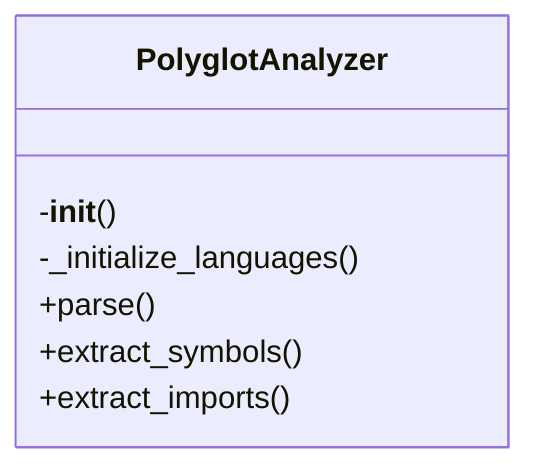

# polyglot_analyzer.py

*Auto-generated from `.github/scripts/polyglot/polyglot_analyzer.py`*

## 🏗️ Structure



# polyglot_analyzer.py

> A lightweight, language‑agnostic source‑code analyzer that uses **Tree‑Sitter** to parse files and extract symbols (functions, classes, etc.) and import statements for a handful of popular languages.

---

## 1. Overview

`polyglot_analyzer.py` exposes a single public class, `PolyglotAnalyzer`, which:

| Feature | What it does |
|---------|--------------|
| **Parser initialization** | Builds a `tree_sitter.Parser` for each supported language (Python, JavaScript/TypeScript, Go, Rust, Java). |
| **Parsing** | Accepts source code as a string and returns a Tree‑Sitter parse tree. |
| **Symbol extraction** | Uses language‑specific Tree‑Sitter queries to find function, class, struct, interface, and method definitions. |
| **Import extraction** | Uses language‑specific queries to find import statements. |
| **Extensibility** | Adding a new language is a matter of adding a binding and a query string. |

The module is intentionally lightweight: it only pulls in the language bindings that are available at runtime and prints a warning if any are missing.

---

## 2. Exports

| Export | Type | Description |
|--------|------|-------------|
| `PolyglotAnalyzer` | Class | Main entry point. |
| (internal) `_initialize_languages` | Method | Builds parsers for supported languages. |
| (internal) `_get_query_for_lang` | Method | Returns the Tree‑Sitter query string for symbol extraction. |
| (internal) `_get_import_query_for_lang` | Method | Returns the Tree‑Sitter query string for import extraction. |

> **Note**: Only `PolyglotAnalyzer` is intended for public use. The other methods are prefixed with an underscore to indicate they are internal helpers.

---

## 3. Usage Examples

> **Prerequisites**  
> ```bash
> pip install tree_sitter
> pip install tree_sitter_python tree_sitter_javascript tree_sitter_typescript tree_sitter_go tree_sitter_rust tree_sitter_java
> ```

### 3.1 Basic Instantiation

```python
from polyglot_analyzer import PolyglotAnalyzer

analyzer = PolyglotAnalyzer()
```

### 3.2 Parsing a File

```python
with open('example.py', 'r', encoding='utf-8') as f:
    code = f.read()

tree = analyzer.parse(code, '.py')
print(tree.root_node.type)  # e.g., 'module'
```

### 3.3 Extracting Symbols

```python
symbols = analyzer.extract_symbols(code, '.py')
for sym in symbols:
    print(f"{sym['kind']} {sym['name']} (lines {sym['line']}-{sym['end_line']})")
    print(f"  signature: {sym['signature']}")
```

### 3.4 Extracting Imports

```python
imports = analyzer.extract_imports(code, '.py')
print("Imports:", imports)
```

### 3.5 Working with Multiple Languages

```python
js_code = """
import { foo } from './bar';
class MyClass {}
function myFunc() {}
"""

js_symbols = analyzer.extract_symbols(js_code, '.js')
js_imports = analyzer.extract_imports(js_code, '.js')
```

---

## 4. Parameters & Return Values

### 4.1 `PolyglotAnalyzer.__init__(self)`

| Parameter | Type | Description |
|-----------|------|-------------|
| `self` | implicit | Instance reference. |

**Return**: `None` (initializes internal state).

---

### 4.2 `PolyglotAnalyzer.parse(self, content: str, extension: str)`

| Parameter | Type | Description |
|-----------|------|-------------|
| `content` | `str` | Raw source code. |
| `extension` | `str` | File extension (e.g., `'.py'`, `'js'`). Leading dot is optional. |

**Return**:  
- `tree_sitter.Tree` – the parse tree, or  
- `None` – if the extension is unsupported or parsing fails.

---

### 4.3 `PolyglotAnalyzer.extract_symbols(self, content: str, extension: str)`

| Parameter | Type | Description |
|-----------|------|-------------|
| `content` | `str` | Raw source code. |
| `extension` | `str` | File extension. |

**Return**: `List[Dict]` – each dict contains:

| Key | Type | Description |
|-----|------|-------------|
| `name` | `str` | Identifier name. |
| `kind` | `str` | One of `'function'`, `'class'`, `'variable'`. |
| `line` | `int` | 1‑based start line. |
| `end_line` | `int` | 1‑based end line. |
| `signature` | `str` | First line of the definition (simplified). |

If parsing fails or the language is unsupported, an empty list is returned.

---

### 4.4 `PolyglotAnalyzer.extract_imports(self, content: str, extension: str)`

| Parameter | Type | Description |
|-----------|------|-------------|
| `content` | `str` | Raw source code. |
| `extension` | `str` | File extension. |

**Return**: `List[str]` – each string is the raw import path/module name. Empty list on failure.

---

### 4.5 Internal Helpers

| Method | Purpose |
|--------|---------|
| `_initialize_languages` | Builds `self.parsers` and `self.languages` dictionaries. |
| `_get_query_for_lang(ext)` | Returns a Tree‑Sitter query string