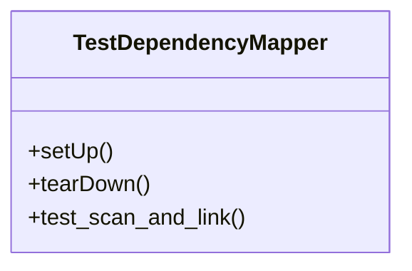

# test_dependency_mapper.py

*Auto-generated from `tests/test_dependency_mapper.py`*

## 🏗️ Structure



# `test_dependency_mapper.py` – API Documentation

> **Note**  
> This file is a **unit‑test module** that validates the behaviour of the `DependencyMapper` class (defined elsewhere in the repository).  
> The documentation below describes the public API of this test module, the test class it contains, and the interactions with the `DependencyMapper` class that it exercises.

---

## 1. Overview

`test_dependency_mapper.py` is a **Python `unittest`** test suite that verifies the correctness of the `DependencyMapper` implementation.  
The test suite:

1. **Creates a temporary workspace** with a mix of Python (`.py`) and TypeScript (`.ts`) files that import each other.
2. **Instantiates** a `DependencyMapper` pointing at that workspace.
3. **Runs** the mapper’s scanning and graph‑building logic.
4. **Asserts** that the resulting dependency graph contains the expected links.

The module is meant to be executed directly (e.g. `python -m unittest test_dependency_mapper.py`) or via a CI pipeline.

---

## 2. Exports

| Export | Type | Description |
|--------|------|-------------|
| `TestDependencyMapper` | `unittest.TestCase` subclass | The test case that exercises `DependencyMapper`. |
| `DependencyMapper` | Imported from `dependency_mapper` | The class under test. It is *not* defined in this file, but the test imports it for use. |

> **Why is `DependencyMapper` imported?**  
> The test file demonstrates how the mapper should be used, so it imports the class to instantiate it. The actual implementation lives in `dependency_mapper.py` (or `polyglot.dependency_mapper` depending on the repository layout).

---

## 3. Usage Examples

### 3.1 Running the Test Suite

```bash
# From the repository root
python -m unittest test_dependency_mapper.py
```

or

```bash
# If you prefer pytest (unittest is automatically discovered)
pytest test_dependency_mapper.py
```

### 3.2 Manual Invocation (for debugging)

```python
import unittest
unittest.TextTestRunner().run(unittest.defaultTestLoader.loadTestsFromTestCase(TestDependencyMapper))
```

---

## 4. Parameters & Method Signatures

### 4.1 `TestDependencyMapper.setUp(self)`

| Parameter | Type | Description |
|-----------|------|-------------|
| `self` | `TestDependencyMapper` | The test instance. |

> **Side‑effects**  
> - Creates a temporary directory (`self.test_dir`).  
> - Populates it with a small file hierarchy (Python and TS files).  
> - Stores the root path as a `Path` object (`self.root`).

### 4.2 `TestDependencyMapper.tearDown(self)`

| Parameter | Type | Description |
|-----------|------|-------------|
| `self` | `TestDependencyMapper` | The test instance. |

> **Side‑effects**  
> Deletes the temporary directory created in `setUp`.

### 4.3 `TestDependencyMapper.test_scan_and_link(self)`

| Parameter | Type | Description |
|-----------|------|-------------|
| `self` | `TestDependencyMapper` | The test instance. |

> **What it does**  
> 1. Instantiates `DependencyMapper(self.test_dir)`.  
> 2. Calls `mapper.scan_workspace()` to discover files.  
> 3. Calls `mapper.build_graph()` to produce a dependency graph.  
> 4. Asserts that:
>    - `main.py` depends on `utils.py` and `sub/lib.py`.  
>    - `app.ts` depends on a file containing `"foo"` (the `foo.ts` component).

---

## 5. Return Values

| Method | Return Value | Notes |
|--------|--------------|-------|
| `mapper.scan_workspace()` | `None` | Performs in‑place discovery; updates internal state (`file_map`). |
| `mapper.build_graph()` | `Dict[str, List[str]]` | Returns a mapping from a file’s relative path to a list of dependency paths (strings). |
| `TestDependencyMapper.test_scan_and_link()` | `None` | The test framework captures assertions; no explicit return. |

---

## 6. Additional Notes

- **Import Path Handling**  
  The test file manipulates `sys.path` to locate `dependency_mapper`. It first attempts a relative import; if that fails, it falls back to a package import (`polyglot.dependency_mapper`). This ensures the test works regardless of the repository layout.

- **File Structure Created in `setUp`**  
  ```
  <tmp>/main.py          # imports utils and sub.lib
  <tmp>/utils.py         # simple helper
  <tmp>/sub/lib.py       # class Lib
  <tmp>/app.ts           # imports components/foo
  <tmp>/components/foo.ts # exports foo
  ```

- **Graph Keys**  
  The keys in the returned graph are *relative* paths (e.g., `"main.py"`, `"sub/lib.py"`). Dependencies are stored as strings that may be relative or absolute depending on the mapper’s implementation.

- **Extensibility**  
  The test can be extended to cover additional languages or import styles by adding more files in `setUp` and corresponding assertions in `test_scan_and_link`.

---

### TL;DR

`test_dependency_mapper.py` is a self‑contained unit test that:

1. Builds a temporary mixed‑language workspace.
2. Uses `DependencyMapper` to scan and build a dependency graph.
3. Verifies that the graph contains the expected edges.

Run it with `python -m unittest` to validate the mapper’s behaviour.