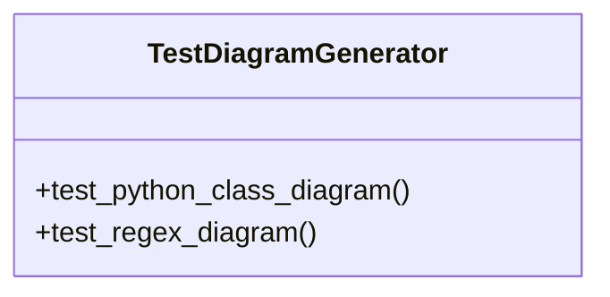

# test_diagram_generator.py

*Auto-generated from `tests/test_diagram_generator.py`*

## 🏗️ Structure



# `test_diagram_generator.py` – API Documentation

> **Purpose**  
> This module contains unit tests for the `DiagramGenerator` class (located in `diagram_generator.py`).  
> It verifies that the generator can parse Python and Java‑style code snippets and produce PlantUML‑compatible class diagrams.

---

## 1. Overview

`test_diagram_generator.py` is a standard Python `unittest` test suite.  
It exercises two parsing methods of `DiagramGenerator`:

| Test | What it verifies |
|------|------------------|
| `test_python_class_diagram` | Parses a Python snippet, checks that the generated diagram contains the expected class names, inheritance arrow, and public methods. |
| `test_regex_diagram` | Parses a Java‑style snippet, checks that the generated diagram contains the expected class name and inheritance arrow. |

The file also includes a small hack to add the repository’s `.github/scripts` directory to `sys.path` so that the `DiagramGenerator` can be imported from the CI scripts folder.

---

## 2. Exports

| Export | Type | Description |
|--------|------|-------------|
| `TestDiagramGenerator` | `unittest.TestCase` subclass | The test case that contains two test methods. |

> **Note**: The module does not expose any functions or classes beyond the test case itself. It is intended to be executed by a test runner (e.g., `python -m unittest test_diagram_generator.py`).

---

## 3. Usage Examples

### Running the tests manually

```bash
# From the repository root
python -m unittest test_diagram_generator.py
```

### Running the tests via `pytest`

```bash
# If you prefer pytest
pytest test_diagram_generator.py
```

> **Tip**: The tests rely on the `DiagramGenerator` implementation being present in the `.github/scripts` directory. Ensure that the repository’s CI scripts are available in the Python path.

---

## 4. Parameters & Return Values

| Method | Parameters | Return Value |
|--------|------------|--------------|
| `TestDiagramGenerator.test_python_class_diagram` | None | None (assertions are performed inside the method) |
| `TestDiagramGenerator.test_regex_diagram` | None | None (assertions are performed inside the method) |

> The test methods do not accept parameters or return values; they simply perform assertions on the output of `DiagramGenerator`.

---

## 5. Detailed Method Descriptions

### `TestDiagramGenerator.test_python_class_diagram`

```python
def test_python_class_diagram(self):
    ...
```

* **Purpose** – Validates that `DiagramGenerator._parse_python` correctly extracts class names, inheritance relationships, and public methods from a Python source string.
* **Steps**:
  1. Defines a multi‑line string containing two Python classes (`Animal` and `Dog`).
  2. Instantiates `DiagramGenerator`.
  3. Calls `gen._parse_python(code)` to parse the snippet.
  4. Calls `gen.generate_class_diagram()` to obtain the PlantUML diagram.
  5. Asserts that the diagram contains:
     * `"class Animal"`
     * `"class Dog"`
     * `"Animal <|-- Dog"` (inheritance arrow)
     * `"+speak()"` (public method signature)

### `TestDiagramGenerator.test_regex_diagram`

```python
def test_regex_diagram(self):
    ...
```

* **Purpose** – Validates that `DiagramGenerator._parse_regex` correctly extracts class names and inheritance relationships from a Java‑style snippet.
* **Steps**:
  1. Defines a multi‑line string containing a Java class (`User`) that extends `BaseEntity`.
  2. Instantiates `DiagramGenerator`.
  3. Calls `gen._parse_regex(code)` to parse the snippet.
  4. Calls `gen.generate_class_diagram()` to obtain the PlantUML diagram.
  5. Asserts that the diagram contains:
     * `"class User"`
     * `"BaseEntity <|-- User"` (inheritance arrow)

---

## 6. Dependencies

| Dependency | Why it’s needed |
|------------|-----------------|
| `unittest` | Provides the testing framework. |
| `sys`, `os`, `pathlib.Path` | Manipulate the import path to locate `diagram_generator`. |
| `DiagramGenerator` | The class under test. |

---

## 7. Running in CI

The test file is designed to run in GitHub Actions or any CI pipeline that checks out the repository and installs the necessary Python packages.  
Add the following to your CI job:

```yaml
- name: Run DiagramGenerator tests
  run: |
    python -m unittest test_diagram_generator.py
```

---

## 8. Summary

`test_diagram_generator.py` is a minimal, self‑contained test suite that verifies the core parsing logic of `DiagramGenerator`.  
It demonstrates how to:

1. Import a custom script from a non‑standard location.
2. Use `unittest` to write clear, focused tests.
3. Assert that generated PlantUML diagrams contain expected elements.

Feel free to extend the test suite with additional language parsers or more complex class hierarchies as your diagram generator evolves.