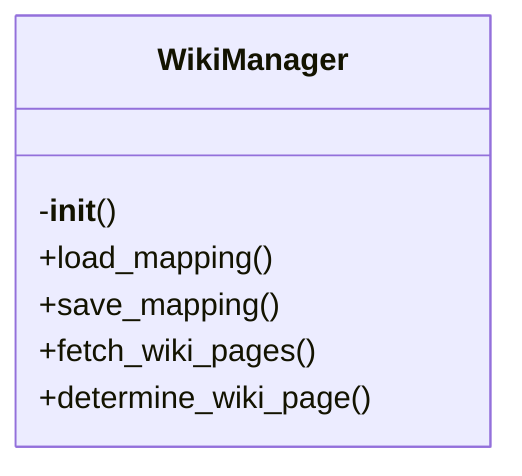

# wiki-manager.py

*Auto-generated from `.github/scripts/wiki-manager.py`*

## 🏗️ Structure



# 📚 `wiki-manager.py` – Smart Wiki Manager

> **TL;DR**  
> A Python helper that automatically routes Markdown documentation to the correct GitHub Wiki pages.  
> It uses a persistent mapping file, the GitHub Wiki API, and an LLM (Groq) to decide where each file belongs, merges content intelligently, and keeps the mapping in sync.

---

## 1. Overview

`wiki-manager.py` is a self‑contained script that:

| Feature | Description |
|---------|-------------|
| **Persistent Mapping** | Keeps a JSON file (`.github/wiki-mapping.json`) that remembers which source file maps to which wiki page. |
| **Wiki Discovery** | Pulls the list of existing wiki pages from the GitHub API. |
| **LLM‑Powered Routing** | Uses Groq’s GPT‑OSS model to decide the best wiki page name for a source file. |
| **Intelligent Merge** | When a page already exists, the script merges new content with the old one using the LLM. |
| **Consistency Checks** | Verifies that the mapping file matches the actual wiki pages and that metadata is up‑to‑date. |
| **CLI Entry Point** | When run directly, it reads `changed_files.txt`, finds the corresponding docs in `docs/`, and updates the wiki. |

> **Why use it?**  
> • Avoids manual copy‑paste of docs into the wiki.  
> • Keeps the wiki organized automatically.  
> • Reduces merge conflicts by merging content instead of overwriting.  
> • Works across multiple languages (`.ts`, `.py`, `.js`, `.go`, `.rs`, `.java`).  

---

## 2. Exports

| Export | Type | Description |
|--------|------|-------------|
| `WikiManager` | Class | Core manager that handles mapping, LLM calls, and wiki updates. |
| `process_documentation_to_wiki` | Function | High‑level entry point that processes a list of Markdown files. |
| `GROQ_API_KEY` | Constant | Environment variable name for the Groq API key. |
| `GITHUB_TOKEN` | Constant | Environment variable name for the GitHub personal access token. |
| `GITHUB_REPO` | Constant | Environment variable name for the GitHub repo (`owner/repo`). |
| `MAPPING_FILE` | Constant | Path to the persistent mapping JSON. |

> **Note** – All other functions are private helpers inside `WikiManager`.

---

## 3. Usage Examples

### 3.1. Running the Script from the Command Line

```bash
# 1. Ensure environment variables are set
export GROQ_API_KEY="sk-..."
export GITHUB_TOKEN="ghp_..."
export GITHUB_REPOSITORY="myorg/myrepo"

# 2. Create a list of changed source files
# (e.g., generated by a CI job)
echo "src/auth.ts" > changed_files.txt
echo "src/api/users.py" >> changed_files.txt

# 3. Run the script
python .github/scripts/wiki-manager.py
```

The script will:

1. Read `changed_files.txt`.  
2. Find the corresponding Markdown files in `docs/`.  
3. Determine the correct wiki page for each file.  
4. Merge the docs into `wiki_updates/<PageName>.md`.  
5. Update the mapping file and generate `wiki_summary.md`.

### 3.2. Using `WikiManager` Directly in Code

```python
from pathlib import Path
from .github_scripts.wiki_manager import WikiManager

# Create a manager instance
manager = WikiManager()

# Load an existing doc
doc_path = Path('docs/auth.md')
content = doc_path.read_text(encoding='utf-8')

# Find the source file (here we know it)
source_path = Path('src/auth.ts')
source_content = source_path.read_text(encoding='utf-8')

# Decide the wiki page
page_name = manager.determine_wiki_page(str(source_path), source_content)

# Update the wiki page (writes to wiki_updates/)
manager.update_wiki_page(page_name, content)

# Record mapping
manager.record_mapping(str(source_path), page_name)

# Persist mapping
manager.save_mapping()
```

---

## 4. Parameters & Return Values

### 4.1. `WikiManager.__init__(self)`

| Parameter | Type | Description |
|-----------|------|-------------|
| *None* | | Initializes the manager, loads mapping, and fetches existing wiki pages. |

| Return | Type | Description |
|--------|------|-------------|
| *None* | | Side‑effects: `self.mapping`, `self.existing_pages`. |

---

### 4.2. `WikiManager.load_mapping(self) -> Dict`

| Parameter | Type | Description |
|-----------|------|-------------|
| *None* | | Reads the JSON mapping file. |

| Return | Type | Description |
|--------|------|-------------|
| `dict` | Mapping data structure. |

---

### 4.3. `WikiManager.save_mapping(self) -> None`

| Parameter | Type | Description |
|-----------|------|-------------|
| *None* | | Writes the current mapping to disk. |

| Return | Type | Description |
|--------|------|-------------|
| `None` | | Side‑effect: file written. |

---

### 4.4. `WikiManager.fetch_wiki_pages(self) -> List[str]`

| Parameter | Type | Description |
|-----------|------|-------------|
| *None* | | Calls the GitHub Wiki API. |

| Return | Type | Description |
|--------|------|-------------|
| `list[str]` | List of page titles. |

---

### 4.5. `WikiManager.determine_wiki_page(self, file_path: str, file_content: str) -> str`

| Parameter | Type | Description |
|-----------|------|-------------|
| `file_path` | `str` | Absolute or relative path to the source file. |
| `file_content` | `str` | Raw source code (used for LLM prompt). |

| Return | Type | Description |
|--------|------|-------------|
| `str` | Wiki page name (e.g., `"Authentication-API"`). |

> **Behavior** – Returns an existing mapping if present; otherwise queries the LLM and falls back to heuristics.

---

### 4.6. `WikiManager._fallback_page_name(self, file_path: str) -> str`

| Parameter | Type | Description |
|-----------|------|-------------|
| `file_path` | `str` | Path to the source file. |

| Return | Type | Description |
|--------|------|-------------|
| `str` | Heuristic page name. |

> **Note** – Private helper; not part of the public API.

---

### 4.7. `WikiManager.update_wiki_page(self, page_name: str, content: str) -> bool`

| Parameter | Type | Description |
|-----------|------|-------------|
| `page_name` | `str` | Target wiki page title. |
| `content` | `str` | Markdown content to add/merge. |

| Return | Type | Description |
|--------|------|-------------|
| `bool` | `True` if the page file was written successfully. |

> **Side‑effect** – Writes/updates `wiki_updates/<page_name>.md`.

---

### 4.8. `WikiManager._merge_wiki_content(self, existing: str, new: str, page_name: str) -> str`

| Parameter | Type | Description |
|-----------|------|-------------|
| `existing` | `str` | Current content of the wiki page. |
| `new` | `str` | New documentation to merge. |
| `page_name` | `str` | Page title (used for timestamp). |

| Return | Type | Description |
|--------|------|-------------|
| `str` | Merged markdown. |

> **Note** – Private helper; uses LLM or simple append.

---

### 4.9. `WikiManager._simple_merge(self, existing: str, new: str) -> str`

| Parameter | Type | Description |
|-----------|------|-------------|
| `existing` | `str` | Existing page content. |
| `new` | `str` | New content. |

| Return | Type | Description |
|--------|------|-------------|
| `str` | Concatenated content with updated timestamp. |

---

### 4.10. `WikiManager.record_mapping(self, file_path: str, page_name: str) -> None`

| Parameter | Type | Description |
|-----------|------|-------------|
| `file_path` | `str` | Source file path. |
| `page_name` |